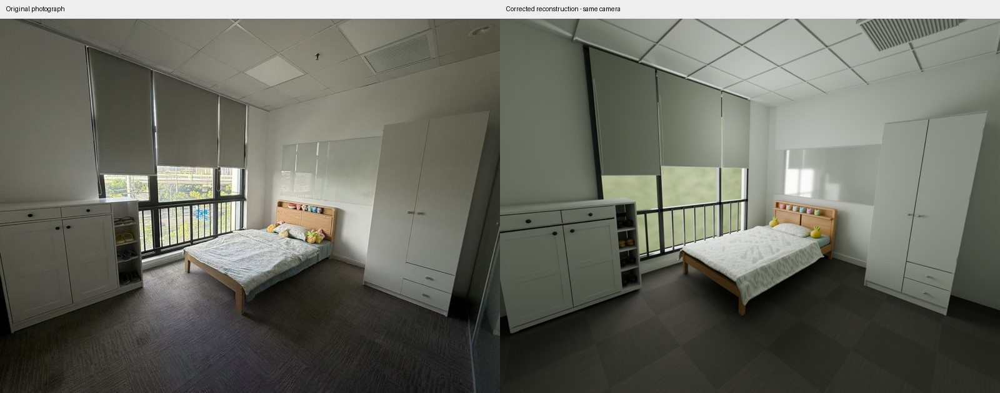

# GPT-6 Astra Real2sim workflow

**简体中文** | [English](README_EN.md)

我们将房间照片重建为可编辑的三维场景，并结合已知家具尺寸和候选型号规格校正比例与摆放。GPT-6 Astra 负责观察、建模决策和预览复查，Blender 与 Python 完成场景构建；可选动力学由对应案例的仿真工具执行。

## 最新结果：卧室单图重建修正版



[播放房间预览与柜门／抽屉动作](https://github.com/Roboparty/gpt-6-astra-real2sim-workflow/raw/refs/heads/main/docs/bedroom/media/room_preview.mp4) · [播放 ArtVIP 柜体对照](https://github.com/Roboparty/gpt-6-astra-real2sim-workflow/raw/refs/heads/main/docs/bedroom/media/cabinet_comparison.mp4) · [新版结果与验证记录](docs/bedroom/README.md)

这版卧室从原照片和家具规格先验独立构建，没有复用 V5 家具网格。修正版纠正了鞋柜门板结构与侧板横缝，重建抽屉，完成完整 16 阶段视觉流程及四铰链、四滑轨的数值仿真扩展。新增的原图证据与实际网格检查能拒绝此前的错误鞋柜。纠错参考了厂家结构照片，且发生在接触参考模型之后，**不属于盲测**。

| 新版资产 | 平均表面差 mm | 中位数 mm | P95 mm | F-score @10 mm |
|---|---:|---:|---:|---:|
| VITBERGET | 8.02 | 4.28 | 28.46 | 71.67% |
| BRUKSVARA | 4.73 | 2.57 | 16.88 | 85.83% |

这是与 ArtVIP 的模型间差异，包含内部表面，不是实物精度。鞋柜均值相对前一版含抽屉模型从 14.23 mm 降至 8.02 mm；本次也补齐了厂家照片支持的内部层板，不能把改善全部归因于门板。衣柜参考资产为棕色版本。[评估协议、关节轴残余差异和限制](docs/bedroom/README.md)。

## 历史 V5 展示

[原 45 秒三房间完整版](docs/showcase/media/overview.mp4) · [历史案例说明](docs/showcase/README.md)

下方 V5 说明及论文对照表保留历史记录，不代表上方新卧室修正版的结果。

## 历史 V5 案例完成了什么

- **用尺寸和型号约束比例。** 三场景案例采用确认的 2m 床长及两款候选柜体的商品规格，将衣柜宽度从约 0.96m 校正为 0.794m、鞋柜从约 1.34m 校正为 1.05m，让家具比例和空间摆放有明确依据。
- **把场景拆成可编辑部件。** 床架、层板、柜门、抽屉、衣物分别建模，提供 21 个静态资产文件对应的资产清单，便于继续修改布局和设置交互。大型模型不随 Git 仓库分发。
- **检查实际生成的资产。** 逐项测量尺寸、网格和参考模型差异，保留结果及复查脚本。当前两款柜子的主体尺寸符合约束，含把手的整体深度仍有偏差，详见[定量评估](docs/showcase/ACCURACY.md)。
- **让修改可以接着做。** 工作流保存阶段结果、参数与证据；修改几何后重新检查受影响的结果，减少从头重跑。

上述历史视频展示的是三场景 V5 案例；仓库另附一个可复跑的杂物房案例，含 MuJoCo 动力学与 GLB/USD 导出检查。两者的结果[分别记录](docs/showcase/README.md)。新版卧室的结果在本页开头单独列出。

## 历史 V5 定量评估

在 V5 原模型上重新测量 21 组资产。两款柜体与 ArtVIP 参考模型的表面差异如下，每个方向采样 60,000 点，保留原始尺度。

| 资产 | 平均表面差 | 中位数 | P95 | F-score @10mm | 含把手整体深度较目录偏差 |
|---|---:|---:|---:|---:|---:|
| VITBERGET 鞋柜 | 12.50 mm | 8.12 mm | 42.98 mm | 59.15% | +55.61 mm（13.90%） |
| BRUKSVARA 衣柜 | 14.40 mm | 5.34 mm | 53.16 mm | 60.13% | +89.98 mm（15.93%） |

床的两根纵向侧梁均为 **2,000 mm**；鞋柜顶板深度 **400.001 mm**、衣柜侧板深度 **565.000 mm**，符合输入尺寸约束。含把手的整装深度仍有上表偏差。

网格检查覆盖 **663 个去重几何对象**：顶点数值全部有限，586 个拓扑封闭，77 个曲线管件存在开放端口；发现 **2,546 个零面积面**，主要在货架、床头装饰、椅座和黑柜加强筋，仍需清理。

以上衡量尺寸约束符合度和参考模型差异。F-score 是距离阈值内双向表面覆盖率的调和平均；缺少独立实测的其他资产尚不能给出实物准确率。[逐资产数据、测量定义与复查脚本](docs/showcase/ACCURACY.md)。

## 历史 V5 与论文结果对照：10 mm / 100 mm

核对日期：**2026-09-25**。选取报告绝对距离阈值的代表性强结果，优先列出单图实验。**这是公开结果对照，不是同场景复跑或统一排行榜**；输入条件按具体实验标注。

### 10 mm（1 cm）：F-score ↑

| 方法／对象 | 重建输入 | 评测范围 | F-score @10 mm |
|---|---|---|---:|
| 本项目：VITBERGET 鞋柜 | 单张房间图＋家具规格／参考辅助 | 单件柜体，相对 ArtVIP | 59.15% |
| 本项目：BRUKSVARA 衣柜 | 单张房间图＋家具规格／参考辅助 | 单件柜体，相对 ArtVIP | 60.13% |
| [SimFoundry][simfoundry]，自动 | **单图** | 12 个 YCB 桌面场景，易／中／难 | 92% / 87% / 81% |
| [SimFoundry][simfoundry]，人工微调 | **单图＋每物体 3 分钟人工调整** | 同上，易／中／难 | 99% / 97% / 93% |
| SAM 3D，[SimFoundry 论文复评][simfoundry] | **单图**；评测另作全局尺度对齐 | 同上，易／中／难 | 71% / 66% / 68% |

论文数字为分组均值，标准差见原表 L.2。**SimFoundry 的这项几何实验使用单图，不是视频输入**：附录 L.1.1 明确说明，两种方法只接收最终摆满物体的场景图；逐件摆放时拍摄的图像仅用于建立准真值。SAM 3D 的全局尺度通过匹配准真值点云求取。

### 100 mm（10 cm）：F-score ↑

| 方法／对象 | 重建输入 | 评测范围 | F-score @100 mm |
|---|---|---|---:|
| 本项目：VITBERGET 鞋柜 | 单张房间图＋家具规格／参考辅助 | 单件柜体，相对 ArtVIP | 100.00%（重新测量） |
| 本项目：BRUKSVARA 衣柜 | 单张房间图＋家具规格／参考辅助 | 单件柜体，相对 ArtVIP | 98.88%（重新测量） |
| SAM 3D，[Lucida 论文复评][lucida] | **单图生成＋共享估计深度定位** | R2S-Scene，选定物体的场景重建 | 79.4% |
| SceneGen，[Lucida 论文复评][lucida] | **单图＋实例掩码**；评测作整场景刚性对齐 | 同上 | 35.1% |
| [Lucida][lucida] | **非单图：视频／多视角＋估计深度** | 同上 | 92.4% |

2026-09-25 已用原 V5 模型和 ArtVIP 参考重新测量。衣柜在 100 mm 下两个方向分别有 **58,667/60,000（97.7783%）** 和 **60,000/60,000（100%）** 的采样点落入阈值，F-score 为 **98.8767%**；鞋柜为 **100%**。输入模型哈希、Blender 4.5.3 版本、配准与采样设置不变，原 1/5/10/20/50 mm 统计全部精确复现。现已保存逐点距离，其他阈值可直接复核。[测量统计](docs/showcase/evidence/surface_metrics.json) · [逐点距离](docs/showcase/evidence/surface_distances.npz) · [复算脚本](docs/showcase/evidence/measure_reference_surfaces.py)

**比较边界：** 本项目测两件独立柜体，保留尺度、对齐底面和包围盒中心，以点到三角面的距离评估，包含内部表面；规格与参考模型参与过制作，并非独立留出测试。论文测多物体场景，包含布局误差，采样和配准也不同。Lucida 复评的 SAM 3D 还使用共享估计深度做米制定位，不能称为纯单 RGB 协议。**鞋柜在 100 mm 下的 100% 不代表超过 Lucida，也不是整间房间的分数。**

来源：SimFoundry，arXiv:2606.28276v4，附录 L.1.1–L.1.3、表 L.2；Lucida，arXiv:2608.30821v1，第 3.3 节、表 4。未把归一化物体指标或相对物体直径的阈值换算为毫米。

[simfoundry]: https://arxiv.org/html/2606.28276v4
[lucida]: https://arxiv.org/html/2608.30821v1

## 开始使用

### 用自己的照片

1. 克隆仓库，在能够读取文件、执行 Python 和调用 Blender 的 GPT-6 Astra Agent 环境中打开。
2. 按[任务模板](public_contract/REQUEST_TEMPLATE.md)提供照片、用途，以及已知尺寸、型号或商品链接；未知项留空。
3. 将[主 Prompt](public_contract/MASTER_PROMPT.md)交给 Agent，按[使用指南](public_contract/USER_GUIDE.md)完成观察、建模和预览复查。

模型访问由你的 Agent 环境提供。新场景需要观察和定制建模；仓库提供工作流与工具入口。

### 复跑附带案例

准备 Python 环境、Blender 4.5.3、MuJoCo 3.13.0、FFmpeg 及离屏渲染条件，按[复跑说明](docs/example/REPLAY.md)安装依赖后运行：

```bash
export R2S_PYTHON=/path/to/venv/bin/python
export R2S_BLENDER=/path/to/blender-4.5.3/blender
export R2S_GPU=0
export R2S_CPU=1
export PYTHONPATH="$PWD/workflow"
"$R2S_PYTHON" tools/rebuild_artifacts.py --output "$PWD/replay_runs/my_replay"
```

输出目录需为新目录。冻结配方复跑不需要重新调用语言模型。

[尺寸与型号说明](docs/FURNITURE_SPEC_ENHANCEMENT.md) · [复跑案例结果](docs/example/RESULTS.md) · [能力与限制](KNOWN_LIMITATIONS.md) · [工具接入](docs/INTEGRATIONS.md)

由 Roboparty 维护，非 OpenAI 官方项目。代码采用 [MIT](LICENSE)；照片、视频和第三方素材适用[媒体与来源说明](MEDIA_NOTICE.md)。
