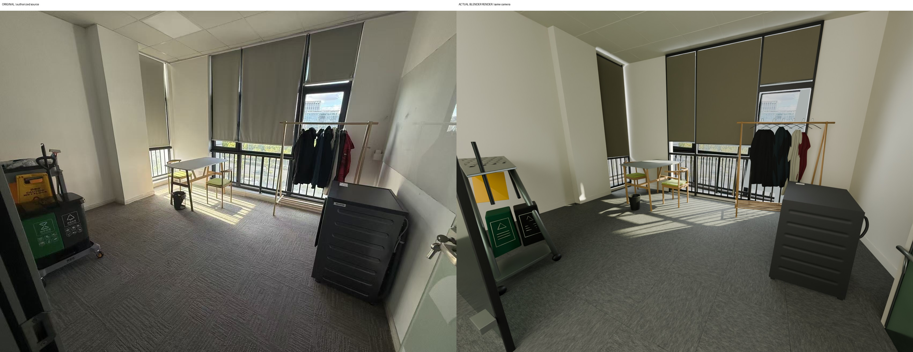

# GPT-6 Astra Real2sim workflow

[简体中文](README.md) | **English**

**Editable simulation scenes informed by images, furniture specifications, and structural evidence.**

A community research-engineering workflow for robotics and embodied-AI teams. Use a tool-enabled GPT-6 Astra agent for observation, spatial reasoning, modelling decisions, and preview review. Python, Blender, and MuJoCo execute numerical fitting, scene construction, rendering, simulation, and checks.

This repository supplies prompts, an executor, tool workers, and a verified case recipe. Your agent host supplies model access; no model weights or standalone Astra inference service are bundled. The frozen example can be replayed without a new language-model call. Maintained by Roboparty; this is not an official OpenAI release.



[Comparison preview](docs/example/figures/comparison_preview.mp4) · [Native physics demonstration](docs/example/figures/dynamics_A.mp4) · [Case walkthrough, Chinese](docs/example/EXAMPLE_WALKTHROUGH.md) · [Results](docs/example/RESULTS.md)

## Why furniture specifications matter

| Additional evidence | Reconstruction use | Expected benefit |
|---|---|---|
| Verified dimensions, with units and measurement definitions | Add scale and shape constraints after establishing image correspondences | Reduce scale and proportion ambiguity |
| Exact brand, model, revision, and configuration | Check structural details and specification drawings | Narrow plausible part arrangements and hidden-shape hypotheses |
| A verified exact-match 3D asset | Operator checks identity, variant, units, usage conditions, and geometry before adoption | Potentially reduce remodelling effort and preserve traceable asset provenance |
| Unverified or conflicting identification | Keep the uncertainty and fall back to independent modelling | Avoid treating visual similarity as exact identity |

**Implementation status:** specification use is agent-guided. A numerical dimension-prior fitting utility and exact-asset branch conventions exist, but automated SKU search, a universal exact-asset importer, and end-to-end automated licence verification are not included. The supplied real-photo example used common size priors; every B object fell back to A. It does not measure a catalogue-dimension or exact-asset uplift.

No improvement percentage or comparative accuracy claim is made. See the [specification enhancement guide](docs/FURNITURE_SPEC_ENHANCEMENT.md) for the mechanism, current support, and a proposed controlled comparison.

## Workflow strengths

- **Editable structures:** whole-object frames and owned parts, with connection, grounding, and visible-mesh intersection checks. Full room surfaces remain present; unseen completion is labelled.
- **Evidence-bound geometry review:** observation hashes, part identities, model versions, and current evidence files are checked. Missing objects, stale evidence, and declared structural failures can block acceptance.
- **Separate geometry and appearance review:** inspect individual objects and combined views before judging final materials and lighting.
- **Executed physics and interchange checks:** the example includes a hinge, cloth, and a tetrahedral seat pad in MuJoCo, plus actual GLB/USD reimports.
- **Traceable revisions:** retain failed attempts, artifact hashes, and revision records instead of replacing the history with a single successful screenshot.

## What has been demonstrated

One authorized room photograph was reconstructed with independently authored geometry. The revised example completed both 18-stage branches and an independent artifact-rebuild run. Six mesh regression scenarios and eight contract checks met their expected outcomes. These are test scenarios, not fourteen independent real-world reconstructions.

The additional loading test ran for approximately two seconds with zero solver warnings under its declared tolerances and assumed material parameters. Furniture landmark errors are in-sample. There is no independent metric or physical ground truth, and the rectangular tabletop still has a maximum landmark discrepancy of about 10.23 pixels.

GLB needs the supplied intrinsics metadata to reproduce the off-axis source camera. Procedural shading may change across formats. See [results](docs/example/RESULTS.md), the [capability matrix](public_contract/CAPABILITIES.md), and [known implementation limitations](KNOWN_LIMITATIONS.md).

## Quick start

Run the standard-library contract fixtures from the repository root with Python 3.10+:

```bash
export PYTHONPATH="$PWD/workflow"
python tools/test_structure_contract.py
```

For the frozen-case rebuild, prepare an isolated remote environment using `requirements-replay.txt`, Blender 4.5.3, MuJoCo 3.13.0, FFmpeg, and a suitable EGL setup:

```bash
export R2S_PYTHON=/path/to/venv/bin/python
export R2S_BLENDER=/path/to/blender-4.5.3/blender
export R2S_GPU=0
export R2S_CPU=1
export PYTHONPATH="$PWD/workflow"
"$R2S_PYTHON" tools/rebuild_artifacts.py --output "$PWD/replay_runs/my_replay"
```

The output directory must not already exist. This recipe checks the supplied photograph's hash and uses model version 4. New inputs require new observations, fitting, modelling, and visual review. The generic agent stages wait for an operator or configured agent command; a successful recipe run does not fabricate visual approval.

## Repository map

| Path | Purpose |
|---|---|
| `workflow/r2s/` | Execution, contracts, structural audits, rendering, export, simulation |
| `public_contract/` | Request template and agent instructions |
| `case/` | Implementations and observations for this photograph |
| `tools/` | Initialization, resume, submission, replay, regression tools |
| `tests/fixtures/` | Explicit contract-test fixtures |
| `docs/example/` | Walkthrough, selected audit records, and previews |

Full models, complete trajectories, duplicate full-resolution audit images, and archives remain in remote artifact storage. They are not bundled in Git; no public model-download endpoint is currently configured. [Artifact scope](ARTIFACTS.md).

Source code, project-authored text documentation, and machine-readable metadata use the [MIT License](LICENSE). Photographs and derived images/videos are covered separately by [MEDIA_NOTICE.md](MEDIA_NOTICE.md). Third-party dependencies retain their own licences. [Provenance](PROVENANCE.md) · [Dependency notices](THIRD_PARTY_NOTICES.md).
