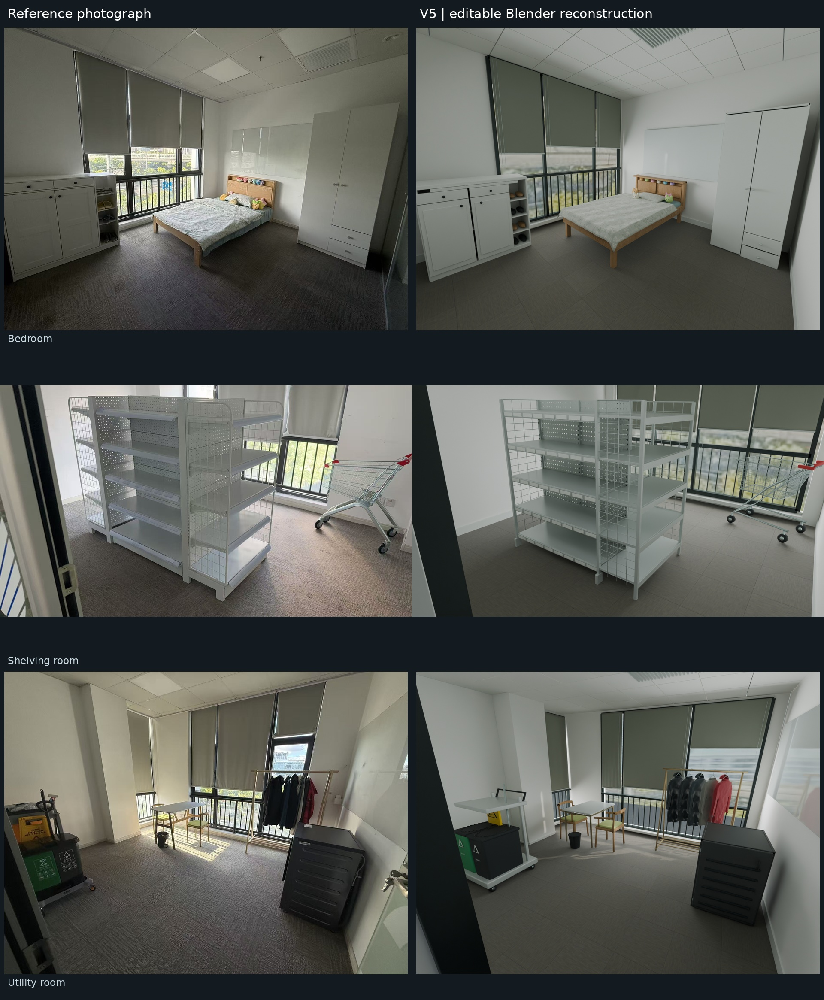

# GPT-6 Astra Real2sim workflow

[简体中文](README.md) | **English**

We reconstruct room photographs as editable 3D scenes, using known furniture dimensions and candidate product specifications to constrain proportions and placement. GPT-6 Astra handles observation, modelling decisions and preview review; Blender and Python build the scene. Optional physics uses the simulator specified by each example.

## Preview

[](https://github.com/Roboparty/gpt-6-astra-real2sim-workflow/raw/refs/heads/main/docs/showcase/media/overview.mp4)

**[Play the full 45-second video](https://github.com/Roboparty/gpt-6-astra-real2sim-workflow/raw/refs/heads/main/docs/showcase/media/overview.mp4)** · [Case and quantitative assessment](docs/showcase/README.md)

The video includes photo comparisons, moving cameras, multiple views and interactions. Its final section compares our cabinets with attributed ArtVIP assets using kinematic playback.

## What we built

- **Dimensions and product specifications guide proportions.** The three-room case uses a confirmed 2m bed length and two candidate cabinet specifications. Wardrobe width changed from about 0.96m to 0.794m; shoe-cabinet width changed from about 1.34m to 1.05m, giving scene placement a concrete scale reference.
- **Editable parts.** Bed frames, shelves, doors, drawers and garments are separate. An inventory covers 21 static asset files for further editing and interaction setup; the large model files are not distributed in Git.
- **Measurements of the generated geometry.** We publish per-asset dimensions, mesh checks, reference-surface comparisons and the scripts used. Cabinet body dimensions follow the constraints; full depth including handles still differs from catalogue dimensions. See the [quantitative assessment](docs/showcase/ACCURACY.md).
- **Work that can be resumed.** The workflow records stage outputs, parameters and evidence so changes can be checked without restarting every step.

The video shows the three-room V5 case. A separate utility-room recipe in this repository supports replay, MuJoCo experiments and GLB/USD export checks. Their results are [documented separately](docs/showcase/README.md).

## Get started

### Your own photographs

1. Clone the repository and open it in a GPT-6 Astra agent environment with file access, Python execution and Blender tools.
2. Complete the [request template](public_contract/REQUEST_TEMPLATE.md) with photographs, intended use, known dimensions and any product references. Leave unknown values unset.
3. Give the agent the [master prompt](public_contract/MASTER_PROMPT.md) and follow the [user guide](public_contract/USER_GUIDE.md) through observation, modelling and preview review.

Your agent environment supplies model access. New scenes require observation and scene-specific modelling; this repository supplies the workflow and tool entry points.

### Replay the included recipe

Prepare Python, Blender 4.5.3, MuJoCo 3.13.0, FFmpeg and offscreen rendering using the [replay instructions](docs/example/REPLAY.md), then run:

```bash
export R2S_PYTHON=/path/to/venv/bin/python
export R2S_BLENDER=/path/to/blender-4.5.3/blender
export R2S_GPU=0
export R2S_CPU=1
export PYTHONPATH="$PWD/workflow"
"$R2S_PYTHON" tools/rebuild_artifacts.py --output "$PWD/replay_runs/my_replay"
```

Use a new output directory. The frozen recipe does not require another language-model call.

[Furniture specifications](docs/FURNITURE_SPEC_ENHANCEMENT.md) · [Replay results](docs/example/RESULTS.md) · [Limitations](KNOWN_LIMITATIONS.md) · [Integrations](docs/INTEGRATIONS.md)

Maintained by Roboparty; not an official OpenAI project. Code: [MIT](LICENSE). Photographs, videos and third-party materials: [media and attribution terms](MEDIA_NOTICE.md).
