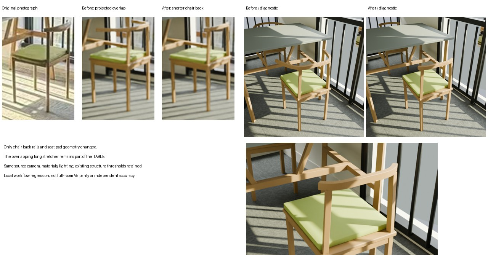

# 工作流改造验证：实拍家具局部返工

日期：2026-09-25。结果：**工作流协议检查通过；一个实拍场景的局部返工闭环通过。尚未证明新场景能普遍达到 V5 外观水平。**

## 工作流已实现

- 用实际渲染绑定模型、源图、对比条件和重点对象裁图；陈旧图像、漏对象和缺少诊断视角会被拒绝。
- 审核缺陷包含对象、证据、负责阶段和策略；执行器定向返工并使下游失效，保留每轮目录。
- 与最佳候选对比并阻止退化候选通过；前后证据必须各含渲染，不能用两张原图替代。
- 预算与停滞状态跨续跑保存，增加预算不使原模型缓存失效。超时终止本次执行的进程组，避免遗留 Blender 子进程。
- 审核阶段不能夹带另一份模型进入导出；完整冻结要求所有配置阶段有效。

观察、建模、材质与复查规则已同步：模板表达不足时局部重建；在家具重叠处先判断部件归属，再检查端点和弧线。执行器不能取代 Agent 的真实看图判断。

## 实拍验证做了什么

使用已有独立重建的杂物房案例，运行缩小的“观察→模型→渲染→审核”图。没有导入 V5 资产，没有覆盖旧案例。模型与计算留在远端，仅取回小型摘要和预览。

这不是从未见照片重建整间房间，也没有运行完整导出与动力学链。四轮审核范围始终是桌椅局部修正和上下文结构保持，不能冻结成完整新场景交付。

| 候选 | 实际操作与审核结论 |
|---|---|
| 1 | 对当前模型重新渲染原图视角和诊断视角。坐垫平面挤出形态触发局部重建。 |
| 2 | 重建两块软包坐垫。用户指出椅背两端像过长扶手；原图局部复查确认长交叉构件属于桌横梁，继续返工。 |
| 3 | 仅缩短两根椅背条，其余 276 个网格保持不变。结构审计发现上一轮坐垫圆角偏离原有角点约束 12.44 mm，超过既有 8 mm 门槛，因此仍不通过。 |
| 4 | 保留短椅背，把坐垫圆角收小至 8 mm、周边下沉限制为 4 mm。重新渲染并复查，原结构审计通过，失败项为空。没有放宽阈值或重标源图点。 |

四轮实际审核经最终工作流合同再次核验：前三轮 `changes_requested`，第四轮 `complete`。所有候选、原始审核和返工事件保留。最初渲染循环运行的是开发中的工作流快照；收尾时使用最终合同重新校验了全部四轮真实图像和模型证据，并单独运行最终执行器回归测试。

## “扶手过长”的具体定位

旧模型椅背半跨度固定为 `width/2 + 0.070`，本例约 235.28 mm；优化位置、朝向、座高等参数不会自动修正这个形状量。原图里桌横梁跨过椅背区域，容易把不同家具的投影轮廓连成一件。

本次保留支柱附近的原曲线和连接位置，把椅背半跨度拟合为 153.80 mm；桌横梁未修改。人工标记的近椅两个端点为约 `(865,590)`、`(822,601)`，标记不确定度约 5 px。

| 端点投影残差 | 修改前 | 修改后 |
|---|---:|---:|
| 端点 1 | 29.82 px | 5.39 px |
| 端点 2 | 45.66 px | 1.26 px |

这些是**输入照片上的拟合残差**，不是独立实测精度；半跨度也依赖原有尺度先验。远椅使用同家族形状是假设，未见部分仍不能由一张图验证。材质与其他制造细节未在本轮全面提升。

## 已执行检查

- `tools/test_refinement.py`：定向返工、依赖失效、修订/停滞/时间预算、完整冻结、预算增加保持指纹、手工相机修订新基线、进程组超时清理、模型/图像绑定、对象覆盖、退化保护、拒绝仅原图对比、拒绝审核阶段替换模型。
- `tools/test_structure_contract.py`：既有 8 项结构合同回归通过。
- 实际 Blender 网格审计：最终桌子、近椅、远椅的归属、连接、支撑、来源点与非预期穿插检查通过。跳过该脚本的额外渲染，诊断图由本次真实渲染单独提供；没有把缺失的视角声称为已渲染。
- Python 编译检查和 `git diff --check` 通过。

远端运行环境为 Python 3.10.12、Blender 4.5.3，渲染使用 CPU 4 线程。进程组清理在 Linux 上执行验证；Windows 分支没有运行时验证。

机器可读摘要：[validation_summary.json](refinement/validation_summary.json)。完整协议和启用方式：[工作流说明](WORKFLOW_REFINEMENT.md)。

## 2026-09-25 鞋柜表面纠错回归

VITBERGET 鞋柜旧模型误建了 20 条细横条，层板端面还与外侧板共面，形成错误横缝。新表面合同检查原图裁切、厂家照片、观察分类及数量，并将实现绑定到实际求值网格。默认启用版本 1；几何及最终材质审核都要求当前正视/侧光证据。旧模型不是因为尺寸检查失败，而是此前根本没有约束正确的表面拓扑。

真实网格回归验证：旧错误模型被重复横条和外侧面重叠检测拒绝；修正后的四个凹面字段通过；修改器增加面板数量、删除实际特征绑定分别被拒绝。13 项合同回归包括不确定线条转几何/凹凸、缺失区域、修改原图裁切、厂家文字冒充图片证据、失效审计和缺失侧光证据等。既有结构、返工协议及元数据回归也通过。结果见 [网格回归](refinement/shoe_surface_20260925/surface_mesh_regression.json)、[合同回归](refinement/shoe_surface_20260925/surface_contract.log) 和 [实际表面视图](refinement/shoe_surface_20260925/surface_review.jpg)。启发式筛查不能代替逐件视觉复核。

本次修订在完整 16 阶段质量图上完成并冻结：`376561bb457cfcac02b18e9b4bbfcc2144428ff25338fdabb629485acba5a2e5`。另完成四铰链、四滑轨的 MuJoCo 数值扩展和 194 帧对照视频；不是以关键帧冒充仿真。原生模型和 GLB 均实际重新载入并核对网格。修复后的实际执行模块与本机主工作区 SHA 一致。

本次重复实验的最终输出相对 ArtVIP 的平均双向表面距离为：鞋柜 8.02 mm，衣柜 4.73 mm；见 [完整指标](refinement/shoe_surface_20260925/evaluation.json)。这些是与原始 ArtVIP USD 的模型间差异，包含内部层板补全，不是实物精度或门板单因素实验；本次修订在访问参考模型后进行，不是盲测。铰链轴线仍有约 7.92–44.22 mm 的参考差异，未声称精确恢复出厂机构。

完整交付由维护者保留在远端（冻结号 `376561bb457c`）。本次重复实验的输入／输出、过程录像及参照测量见 [重复实验记录](bedroom/README.md)；大型模型和历史结果留在远端。
