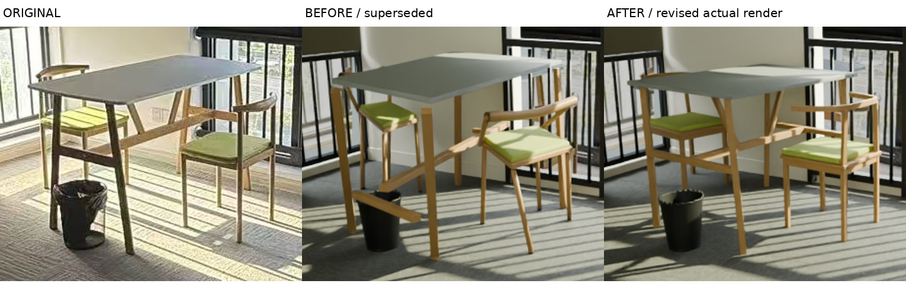
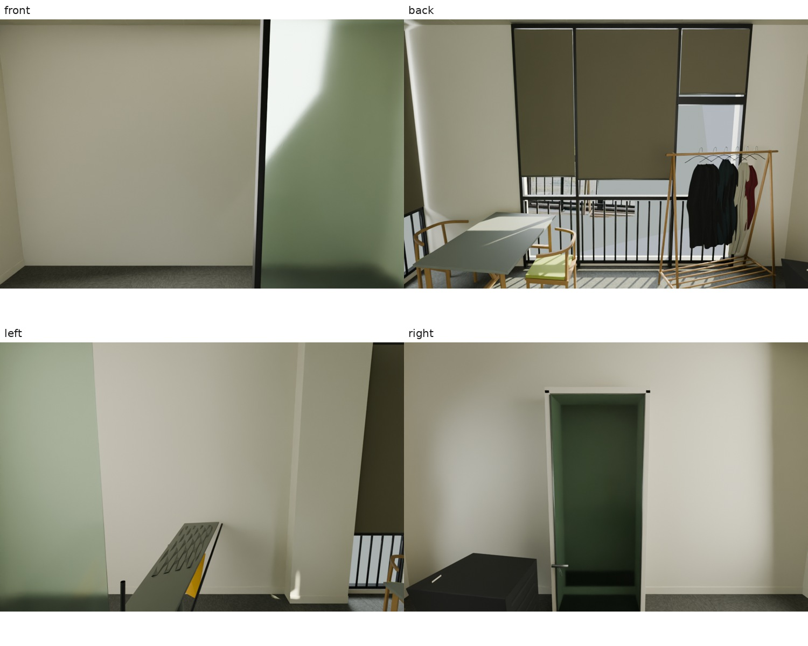
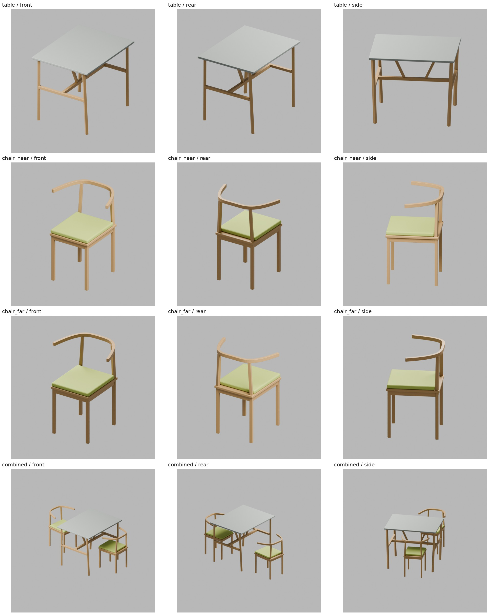
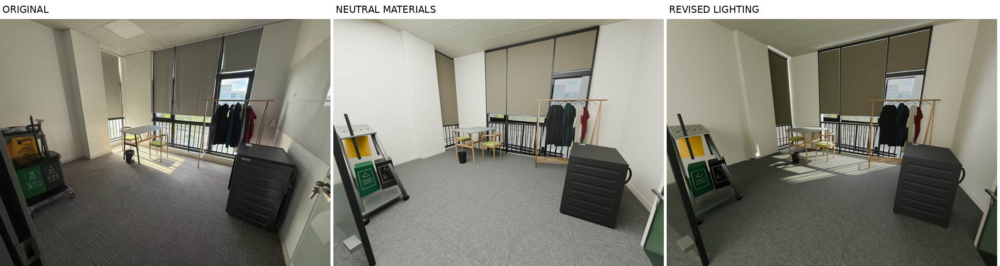
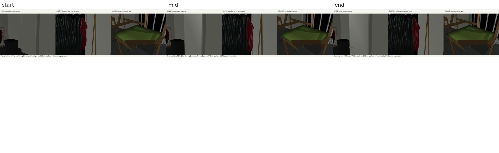

# 单张实拍到可编辑场景：桌椅结构与生成链路修订版

本例从一张获得授权的室内实拍照片出发，完成 A/B 建模、材质/光照、铰链/布料/体积柔体、格式导出和实际重载。**初版虽然走完 18 个阶段，却漏判了桌椅局部结构错误。** 用户指出后，本版通过正式 `revise` 重建桌子和两把椅子，并把观察、部件建模和结构验收连起来。旧模型、旧审核、失败记录和归档保留，不用新结论覆盖历史。

这是一份原图约束的展示与仿真功能示例。没有独立尺寸或物性测量，不提供现实准确率。B 没有核实到准确同款资产，全部回退 A；两条流程共享几何和外观优化，不声称独立资产优势或耗时优势。

## 完整任务表单与实际 Prompt

| 字段 | 本次输入 |
|---|---|
| 原始文件 | `inputs/utility_room_original.jpg`，1702 × 1276，243723 字节 |
| 来源 | 用户于 2026-09-22 确认本人或团队拍摄；没有可用 EXIF |
| SHA-256 | `dfe25afbfb885ae9bc377691dd18ebd4259ffa72917ca725e3809ef40624c29c` |
| 允许输入 | 仅此一张实拍，不使用旧案例的其他照片、模型或分析 |
| 用途 | 静态展示、A/B 方法对照、实际仿真功能演示 |
| A | 查询规格但自行恢复几何 |
| B | 只有准确型号和版本被核实才采用外部资产，否则逐对象回退 A |
| 必保留 | 四面墙、地面、天花板、灯具；不可见补全部分单独注明 |
| 重点 | 房间与门窗连接、相机、桌椅柜体、日光、地毯、衣物；本次特别修复桌椅结构与验收链路 |
| 尺寸/独立真值 | 无实测，无独立验收真值；允许记录清楚的先验 |
| 动态 | 铰链、布料、适用的体积柔体均开启；不添加图中不存在的软体对象 |
| 格式 | 可编辑 Blender、GLB、USD、MuJoCo，图像/视频、轨迹、证据与复跑入口 |
| 资源与发布 | 大型模型和归档留在执行端；本机只保留阅读材料；不公开发布 |

实际通用指令见 [MASTER_PROMPT.md](../../public_contract/MASTER_PROMPT.md) 和 [AGENT_EXECUTION_SPEC.md](../../public_contract/AGENT_EXECUTION_SPEC.md)，任务原文见 [USER_REQUEST.md](../../USER_REQUEST.md)。本例脚本只是一张照片的实现；通用执行器负责依赖、证据合同和执行，不会因此自动理解任意新照片。

## 一、保护输入、预处理

原始 JPEG 按字节保存、解码并核验哈希；裁剪、预处理和渲染对比都是派生文件。来源“已核实”指用户的拍摄声明，不是尺寸或相机标定证书。最终同相机渲染按 1702 × 1276 对齐，局部图只用于检查，没有替换全图验收。

阶段输入、参数、输出与状态见 [stages.json](evidence/stages.json)。整理版 JSON 将内部绝对路径改为相对路径；原始运行记录仍在私人工作区，交付清单核对的是整理副本自己的字节。

## 二、观察必须能约束实际建模

初版对象轮廓和文字关系不足以表达“哪根支柱属于哪把椅子、接在哪条座框边”。新版新增 [furniture_observation.json](../../case/furniture_observation.json)，包含家具归属、部件清单、源图点 ID、像素坐标、可见/部分可见/遮挡状态、结构约束、歧义和拟合前阈值。

近侧椅的靠背支柱属于后座框边，不能连向前边；远侧椅的三个被遮挡脚点不再当作已测位置；桌架和椅背在图像中交叠不代表它们在三维中相连。构建器实际读取这份观察及拟合参数，验证原图、观察与相机文件哈希，再生成模型。每个对应点还绑定到明确的实际部件网格。

型号检索仍遵循准确同款规则：CH20 只是未核实风格候选；POÄNG、RÅGRUND 与 SONGMICS 晾衣架因构造不符被排除。没有下载外部家具网格或把厂家尺寸当作实测。来源、检索日期与逐对象回退见 [catalogue.json](evidence/catalogue.json)、[assets.json](evidence/assets.json)。本次未虚构一次新的检索。

## 三、相机与完整房间

保留原有房间校准：焦距 610.95997 px，主点 (909.75662, 618.66610) px，相机约 (3.28505, −3.07451, 1.18733) m。绝对尺度由层高 2.8 m 的先验固定，记录范围为 2.45–3.15 m；零畸变也是假设。

房间/窗/柱的 8 个拟合点中位误差 6.316 px、最大 15.924 px，只属于这组拟合点，**不作为桌椅通过的依据**。历史名为 `back_right` 的点表示窗右端，不是整间房的右角；右侧延伸约 0.68 m、前墙和不可见返墙均为假设。

四墙、地面、顶面、灯具始终保留。新增检查视角是模型自检，不是额外实拍证据。排除本次修订的五个语义实体后，其余 280 个实际求值几何/相机对象与同任务初版完全一致，见 [unaffected_geometry.json](evidence/unaffected_geometry.json)。

## 四、完整家具结构与可执行验收

初版把桌面、座面、椅背和脚点分别按图片坐标及假设高度反投影，再按简化索引连接；还有一次脚点 XY 平均移动。新版用统一局部坐标和整件尺寸拟合：

| 家具 | 本版结构 |
|---|---|
| 桌子 | 矩形薄桌面、两端支架、四腿、端部横档、连接横档的纵向撑杆及斜撑；隐藏榫接/撑杆方案为估计 |
| 近侧椅 | 四腿、四边座框、承托板、绿色垫；两根后支柱连接后座框并承托弯曲背条，垫后缘避让支柱 |
| 远侧椅 | 同家族尺寸先验、独立位置和朝向；遮挡部件按连贯结构补全，不伪称全部看得见 |

候选 019、模型版本 4 是本版几何基础。参数见 [furniture_parameters.json](../../case/furniture_parameters.json)。旋转、尺寸和脚点都由整件模型共同确定，没有再平均挪动脚点。

孤立检查图临时隐藏其他物件，用于看清部件关系；该可见性状态没有保存为交付模型。完整房间图仍保留全部壳体。

通用链路增加 `real2sim.assembly/1` 结构合同：部件唯一归属、实际对象名、连接图、共享接头锚点、脚部支撑、观察 ID。`build_geometry` 对**实际求值可见网格**运行所有非接头部件对与家具间的相交/穿入筛查、接头距离和落地检查；不使用动力学碰撞代理代替可见几何。

拟合对应点重新寻找其所绑定部件上的实际网格点并投影，而不是直接抄拟合文件里的残差。本版中位/最大残差分别为：桌子 7.619/10.233 px，近侧椅 4.153/7.772 px，远侧椅 5.224/7.586 px。它们仍是同图拟合，隐藏结构和绝对尺度不确定性没有消失。

审核必须覆盖当前 38 个语义实体，明确状态、具体发现和实际文件引用；冻结哈希绑定当前模型，审计副本哈希绑定执行器原始结果。缺对象、旧版本、错误文件引用或修改审计均不能通过。仅有 `status=pass`、非空说明、整体亮度或成功导出不够。

保留了真实失败：早期修订把靠背上支柱和更低的裙边声明为直接接头，检查发现约 13 mm 间隔；其实际传力经过后腿/座板，修正了错误连接声明。检查器的重复近距离射线命中也曾把梁内部接头误判在外，修复了有向闭合网格的符号距离判断，并验证合理接触不会被误拒。

随后用真实 Blender 网格注入断腿、横档错位、桌椅穿插、错误归属，以及“整件刚性移位但保留旧源图点”五类错误，均被拒绝；正常结构通过。另有八项合同测试覆盖漏审、错误引用、旧哈希/版本、缺状态、改写审计和断开的连接图。见 [mesh_mutation_tests.json](evidence/mesh_mutation_tests.json) 与 [contract_tests.json](evidence/contract_tests.json)。这些是明确的测试范围，不是能发现任意形状错误的证明，人工局部审查仍必需。

## 五、材质与光照重新生成

在新几何上重新生成中性材质图，再应用并复查已有日光估计。固定相机、几何与 PBR 参数；光照阶段没有用挪家具或改底色掩盖结构问题。使用 AgX、Medium High Contrast、曝光 0；灯具保留但不发光。

六个线性亮度 ROI 继续作为外观诊断，完整当前值见 [appearance_metrics.json](evidence/appearance_metrics.json)。它们不覆盖所有家具部件，也不承担结构验收。几何/相机及材质锁定记录随阶段证据交付。

室外遮罩只来自原图室外像素；它是依赖原视角的背景，没有室内照片投影，也不代表恢复了室外三维。室外遮挡代理与隐藏门洞返墙仍是低置信假设。

## 六、最终局部与全图视觉复查

实际查看原图、同相机新渲染、桌椅局部修正前后、单件正/侧/后与组合多视角，再查看完整壳体。修订后桌椅具有明确部件归属与连接；最终材质和阴影下仍能辨认结构。

仍有可见差异：固定房间相机下矩形桌面角点最大约 10.23 px 的拟合残差；准确背条曲率、隐藏撑杆/榫接、细布褶、文字、磨损和精确阴影均近似。未把这些描述成真实测量。A/B 同样使用本次严格局部验收；B 全回退 A，因此共享外观是明确记录的事实。

## 七、重新构建坐垫体积、碰撞与实际仿真

静态参考姿态单独保留。动态使用 MuJoCo 3.13.0 的 `discrete` 积分器并启用接触，重新运行基础及加载测试：门板铰链、299 顶点/528 三角形红衣布料、75 顶点/192 四面体近侧坐垫。新坐垫体积从当前原生求值包络建立，未复用旧坐垫包络或旧轨迹。

桌椅碰撞按新构件生成内接、端点缩短的胶囊和有朝向的板/裙边盒体，不使用整椅 AABB。曲面背条碰撞仍简化/未参与本次演示；可见结构完整性由前一步实际网格检查单独判断。

门质量 36 kg、布料模量 5 MPa、坐垫模量 100 kPa 等均为先验。绿色部件按薄软垫解释，填料未知；没有添加无图像依据的软体。初版 20 kPa 在 300 N 试验中退化的记录仍保留，该调参不能当作真实材料识别。

加载试验为 4000 步 × 0.0005 s，约 2 s：门板 8 N·m 持续 1.3 s、衣物总风载不超过 0.12 N、软垫分布载荷 0→300 N 后释放。形变每 0.025 s 采样，接触/限位/警告每步检查。当前结果和真实轨迹见 [RESULTS.md](RESULTS.md) 与 `evidence/A`、`evidence/B`。

视频：[A](figures/dynamics_A.mp4)、[B](figures/dynamics_B.mp4)。30 fps，播放速度为物理时间的 0.75 倍；没有放大形变或用关键帧替代求解。验证的是 MuJoCo，不声称 Blender 自带布料缓存。小幅负接触距离是数值穿透，不能写成零穿透；最小四面体体积比是单个单元指标，不是整垫体积。

## 八、导出、重载、执行快照与复跑

交付每条分支的原生 `scene.blend`、导出快照 `scene_evaluated.blend`、GLB、USD、静态及动态 MJCF，连同纹理、碰撞网格与审计。原生文件优先用于编辑和最终外观。

继续使用初版实际发现问题后的导出修复：先记录原生求值几何，再烘焙导出副本，避免清理法线改变 Solidify 方向使坐垫下移 3 cm。当前所有格式重新生成并实际加载，不能沿用旧通过项。

GLB 核心相机不表达偏心主点；精确相机须读取 `scene.json` 或 extras 中的 `r2s_intrinsics_json`。USD/GLB 的程序化着色不保证与 Blender 一致。当前几何、相机和动力学重载数值见结果文件；格式误差不等于现实准确度。

执行器还修复了相对 `PYTHONPATH` 随子步骤工作目录变化而误加载另一安装版本的路径问题：子步骤现在明确绑定当前流程快照，并输出实际执行代码哈希。这次通用代码改变使相关指纹失效，观察/校准等未改变的同任务证据明确注明沿用，几何与受影响下游重新执行。没有手写成功状态。

新版冻结配方再次从原图生成所有工件、结构审计、导出、重载和加载演示；结果见 [replay/REBUILD_RESULT.json](evidence/replay/REBUILD_RESULT.json)。它证明本例配方可复跑，不等于任意新照片自动建模或新一次人工视觉认可。

继续阅读：[RESULTS.md](RESULTS.md)、[REPLAY.md](REPLAY.md)、[PIPELINE_CHANGES.md](PIPELINE_CHANGES.md)、[FILE_MANIFEST.json](FILE_MANIFEST.json)。轻量阅读副本不含 `outputs`；完整模型及新归档保留远端，未公开发布。
