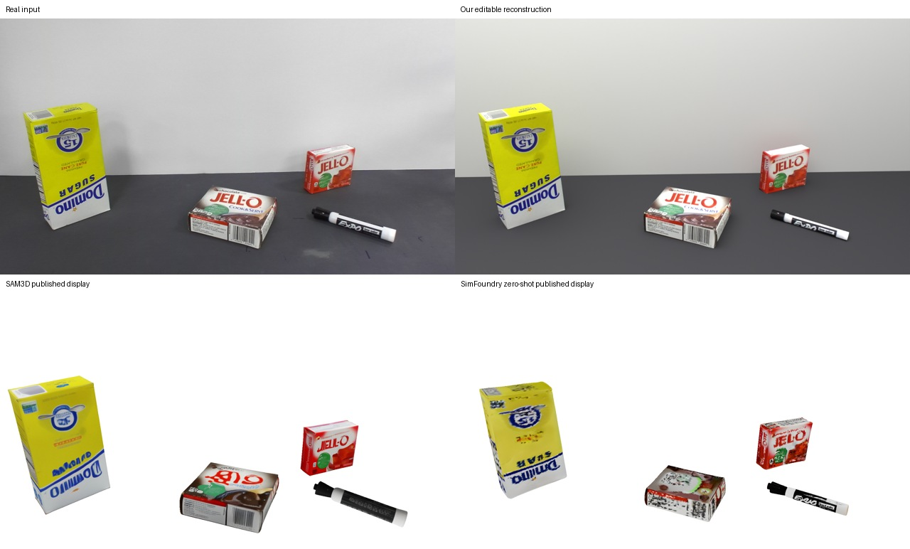
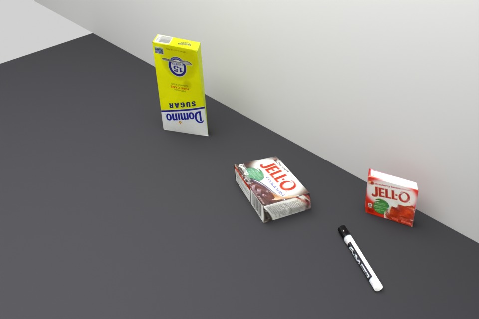

# Desk 1 / Easy：可编辑实体与同图对照

已完成用户指定的 SimFoundry YCB Desk1/Easy 案例：**单张真实输入→四个可编辑物体→同图渲染对照**。
模型是闭合网格实体，不是点云、深度图或整张照片背景板。只有一个已知真实视角；附加视角仅为虚拟检查。

## 实际文件

- 模型：`4090-1:/data/real2sim_capability_wqz_20260929/simfoundry_desk1/authoring_002/scene.blend`
- 模型大小：**1,498,284 字节**，原图已打包；打开不需要重新下载纹理或运行模型。
- SHA256：`b170ee70448a941e32a7777da1a9bc5af13bb4e727c32326c13a6af175a748ca`。
- 同图渲染：同目录 `source_view.png`；虚拟检查：`virtual_inspection.png`。
- [对象清单](evidence/desk1_editable_20260930/objects.json) · [模型重开检查](evidence/desk1_editable_20260930/model_check.json)。

四个对象是倒置 Domino 糖盒、平放 Chocolate Jell-O 盒、直立红 Jell-O 盒和 Expo 笔。
前三个分别为独立闭合六面网格；笔分为黑帽、白筒、尾塞三个闭合圆柱部件，另有独立桌面与墙面。
六个前景部件均验证为闭合、有正体积；两版的前景顶点、变换和相机完全一致，第二版只改桌面/墙面颜色。

## 输入、方法与边界

唯一建模图为论文表 L.3 中的 Desk1/Easy 原图：
[ycb_desk_3.jpg](https://arxiv.org/html/2606.28276v4/figs/imgs/qualitative_results/ycb_desk_3/ycb_desk_3.jpg)，
1920×1080、430,554字节，SHA256
`f125bdbe59e6e978d22e5143131291a1ef5206239928007a01d26aabb1bb9578`。
论文该几何实验给各方法的是最终场景单图，使用逐物体增量采集获得的准真值评估。
本次没有获得该案例的逐实例准真值包，也未使用YCB GT模型或位姿拼装场景。
[论文附录 L.1 与表 L.3](https://arxiv.org/html/2606.28276v4)。

本次为 **Agent 辅助的单图作者式近似重建**：从原图标注三个纸盒的可见面外廓，以假定
高度和渲染相机将角点射线放入三维，补全不可见角和背面；再把该原图纹理固定投影到对象
局部坐标。物体移动时纹理随对象移动，但纹理包含原照光照，不是分离出的物理反照率。
笔采用分段圆柱和同样的源图投影，没有额外建造不可见裸笔尖。

渲染相机焦距、俯角、高度，以及纸盒厚度、隐藏面和米制尺度均为 **assumed**。
没有相机标定文件，也没有新的相机/学习模型推理或参数搜索。闭合六面体可存在轻微剪切，
不等同于精确正交YCB CAD。对源视角的高保真不能证明背面、真实尺寸、物体姿态或物理可用性。

## 和公开方法怎样比较

模型、源视角渲染和作者记录先按哈希冻结，随后才下载 SAM3D 与 SimFoundry 的公开展示。
[冻结记录](evidence/desk1_editable_20260930/authoring_freeze.json)与
[展示图来源/哈希](evidence/desk1_editable_20260930/published_comparisons.json)保留此顺序。
这些是论文展示，**不是本次重跑**，也没有被用于模型的形状、摆放或纹理生成。

此视角中，本次结果保持了与原图接近的排布和清晰的标签；SAM3D公开图有可见的标签/形状变形，
SimFoundry公开图有更明显的纹理破碎。但本次使用了人工可审查的轮廓约束和源图投影，
背景、渲染条件和自动化程度也不同，因此不能据此判定三维几何优于二者。
不把论文 Easy 分组均值当成该单例分数；没有计算或宣称该案例的3D Chamfer/F1/姿态精度。

本次结果仍有过于平整的盒面/边角、近似笔帽、简化接触阴影以及缺失桌面划痕等问题。
不可见背面只有材质先验；虚拟检查角度不是第二张真实视角验收。
模型未做MuJoCo任务验收，按本轮交付范围不以此延迟模型展示。

## 保留记录与资源

[首版](evidence/desk1_editable_20260930/first_candidate.json)保留背景过亮问题；
[最终版](evidence/desk1_editable_20260930/final_candidate.json)只修正两种支撑材质。
[原图记录](evidence/desk1_editable_20260930/source.json)、
[首版协议](DESK1_SCENE_PROTOCOL_20260930.json)、
[修订协议](DESK1_SCENE_REVISION2_20260930.json)及可复现作者脚本均提交研究分支。

这是用户明确选择的新案例，先登记了[两版以内的作者范围修订](DESK1_AUTHORING_SCOPE_20260930.json)。
原8次外观候选和全部成本不变，新案例用2次，累计10次；原模型/相机实验仍为8/8，没有新增推理。
两版均为2线程CPU渲染，GPU/API新增为0。没有下载BOP大包或开始新的定量支线。

此前已完成的[Waterfront 173部件模型与三个真实视角](WATERFRONT_EDITABLE_DELIVERY_20260930.md)
及未验收参考读取补丁仍完整保留。主分支未改变；当前模型是研究分支交付给用户检查的近似结果，
不是未经验证的SOTA或正式物理资产发布。
