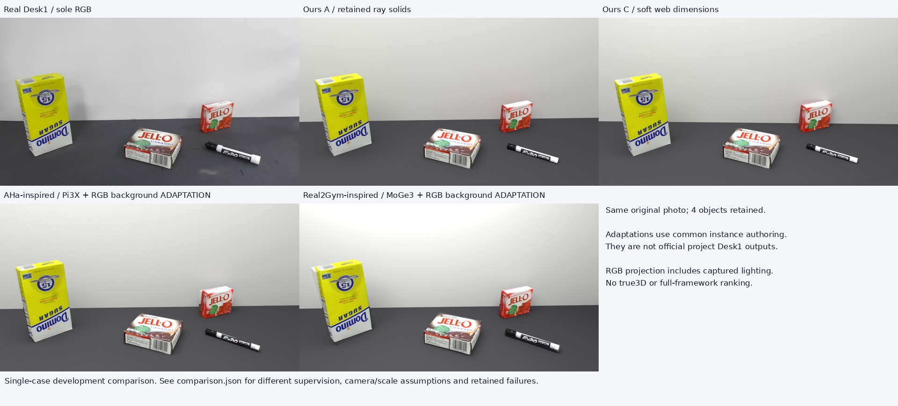

# Desk1：GPT-6 Real2Sim 项目检索与静态路线适配对照

本轮找到四个相关公开项目，并在同一张 Desk1 原图上实际执行了两条几何参考路线的**静态适配实验**。当前原生场景的源图贴合度更高，但本实验不是第三方完整 GPT-6 Astra 框架的独立复跑，不能据此给完整框架排名或宣布 SOTA。

## 公开项目及本场景适用性

| 项目 | 固定代码版本 | 公开方法与结果范围 | Desk1 本轮状态 |
|---|---|---|---|
| [AHa-3D](https://github.com/KevinXu02/aha-3d/tree/82f4b1110cfe4b55fff19df3b3790852ce07b171) | `82f4b111` | GPT-6 Astra 工具流程，室内视频、Pi3X/SAM3参考、资产构建与复核 | 执行其 Pi3X 参考路线的单图适配；未执行完整视频、SAM3、TSDF及独立 Astra 迭代 |
| [HKU Real2Sim_GPT6_ASTRA](https://github.com/hku-sail/Real2Sim_GPT6_ASTRA/tree/a1624d6431eb27e2a437feaf74fb34b7c8e937a2) | `a1624d64` | 三视角机器人场景/动作重放及通用流程文档；实际 builder 消费保存的案例观测和运动 | 原版未在 Desk1 执行；不能把机器人案例的相机、轨迹和工程当本图重建 |
| [GPT6-real2sim](https://github.com/lingxiao-guo/GPT6-real2sim/tree/736da5c2c6da040a653e581b8f8052ae5559ad51) | `736da5c2` | DROID/YAM 半手工场景拟合、已保存资产与接触回放；部分任务失败保留 | 原版未在 Desk1 执行；原拟合器需要其机器人 episode/标定/观测 |
| [Real2Gym](https://github.com/real2gym/Real2Gym/tree/512548cd01777b48d9cd98cc1d8d07efb8ed0e55) | `512548cd` | GPT6 Astra 协调重建/执行；单 RGB 明确用 MoGe-3 首帧几何，再按 RGB 构建实例 | 执行 MoGe-3＋RGB实例静态适配；没有动态执行、增强或独立 Astra 运行 |

模型身份依据作者文档、名称和流程声明，未审计作者历史模型会话。递归仓库树均未截断；已检查的案例和路径未定位到与本张 Desk1 匹配的公开输出，这不证明网络上绝不存在该结果。未把未经核实的社交演示、目录索引或未修改 fork 计成独立方法。

Real2Gym 旧 `cskrren/Real2Gym` 链接仍404，但当前 `real2gym/Real2Gym` 已确认公开，旧“未解析仓库”的发现障碍已解决。原失败记录保留，不能沿用旧链接断言项目不可用。检索记录见 [项目版本清单](GPT6_PROJECT_CATALOG_20260930.json)。

## 实际执行范围

本次只使用源图 SHA256 `f125bdbe59e6e978d22e5143131291a1ef5206239928007a01d26aabb1bb9578`，没有第二真实视角、GT模型/姿态/深度，未读取旧场景相机或尺寸拟合值用于新重建。

两条路线共享由当前 GPT-6-family 助手编写的可编辑实例适配器：RGB识别出三个纸盒和一支带帽笔；新预测点图辅助支撑平面、方向、尺寸与摆放，完成正交盒体和圆柱部件。复用的四个可见区域来自原图的人工轮廓，**不是 SAM 推理**，且轮廓曾使用之前的人工角点，因此不报告独立留出角点成绩。两条路线都保留全部4对象/6前景网格，没有挑选成功物体。

- **AHa-inspired / Pi3X：**固定已有 Pi3X代码/权重，对唯一图像实际前向一次，不复制假视角。原始输出保存了 `points/local_points/rays/conf/camera_poses/metric`。先保存完整 tensors，再修复适配器把真实 `conf` 字段误写成 `confidence` 的读取问题；修复只用 CPU，没有重新推理。中心针孔焦距从预测局部点方向估计，预测 Z 通过该相机重投影；该自一致性不是真实精度。统一尺度使用历史 YCB 糖盒0.175m作为**假设家族先验**，不是恢复的真尺度。
- **Real2Gym-inspired / MoGe-3：**固定官方 `microsoft/MoGe`代码 `74fbce05`、`Ruicheng/moge-3-vitl` revision `184008f8` 和权重 SHA `9b41b7b9f65ad80aab7ad686f5e9cc0d1fd33f1964022618dfbcd52fc1fb7925`。首图1280×720、resolution9、refine3、FP32、seed2026；原始points/depth/normal/mask/intrinsics均保存。模型公制输出仍是估计，没有独立尺度测量。[公开单图初始化规范](https://github.com/real2gym/Real2Gym/blob/512548cd01777b48d9cd98cc1d8d07efb8ed0e55/skills/real2sim-prompt/references/geometry-initialization.md)

可见面采用相同种类的源照片局部投影材质，包含原始光照，未恢复独立 albedo。新路线是“一次几何参考＋共享实例构建”，原生 B/C 则用了人工二维角点和联合相机/盒体优化；监督、优化自由度、完整 Agent 迭代次数和准确模型会话并未严格匹配。差异不能全部归因于项目框架。

## 原图效果对照

下表统一重新使用同四个人工源区域计算；因此与上一报告的旧ROI数字略有区别，旧结果未改写。MAE范围0–255，越低越好；IoU为投影网格凸包与源区域的交并比，越高越好，使用未倒角网格，不是实际渲染实例分割。

| 实际条件 | 前景 RGB MAE ↓ | 全图 RGB MAE ↓ | 四对象平均投影 IoU ↑ |
|---|---:|---:|---:|
| 原生 A：保留射线角点模型 | 12.42 | 13.19 | 0.973 |
| 原生 B：图像＋既有高度假设 | 14.51 | 15.78 | 0.945 |
| 原生 C：联网软尺寸先验 | 14.48 | 15.37 | 0.939 |
| Pi3X 单图适配初版 | 15.29 | 22.99 | 0.865 |
| MoGe-3 静态适配初版 | 17.70 | 29.28 | 0.857 |
| Pi3X 适配＋共同 RGB 背景修正 | 15.68 | 16.28 | 0.865 |
| MoGe-3 适配＋共同 RGB 背景修正 | 17.75 | 22.51 | 0.857 |

初版中桌面右侧截断、墙/桌边界错位。追加同一背景修正规则：由原始 RGB 的墙/桌明暗边界和已估计相机，把支撑面扩展到可见桌面射线及物体支撑边界，并沿源边界放置直立后墙。**前景世界顶点和源相机保持不变**，实际 Blender 读回确认。

全图误差改善，但前景误差略退步，原因不能归为前景几何变化；背景调整会影响光照与反射。本轮把两项改善和两项退步都保留，没有按物体拼接最优结果。背景修正第一次因固定图像强度阈值未找到边界，在任何保存/渲染之前失败；改为依据同一源图上/下区域的中位强度求阈值，两次失败输出目录仍保留。

完整数值和每物体读回见 [统一掩膜复算](evidence/gpt6_peers_20260930/comparison_with_rgb_revision.json)；[初版对照图](../../examples/desk1_gpt6_peers_20260930/comparison.jpg)同时保留。所有 `.blend` 均已只读打开，源模型哈希绑定到指标；原始照片和旧模型前后SHA不变。

## 当前能说与不能说的结论

在这张图、本轮明确披露的静态适配条件下，当前原生 C 的前景/全图误差较小、投影覆盖较好。两条新参考路线保留了主要物体，但比例、体积/摆放和外观仍有偏差。保留 A 的图像误差最低，却仍有已测21.3°最大直角偏差，不能因贴图像更近就称几何更真。

这不是“我们的完整 GPT-6 框架优于 AHa-3D/Real2Gym”的证明：我们没有运行作者完整工具链、独立 GPT-6 Astra 会话或匹配全部 Agent/算力预算；HKU和Lingxiao在本图没有实际重建输出。图像贴合、三维精度、物理可用性及完整框架性能分别保留未知。单图源纹理投影也能掩盖形状错误。

下一项有判别力的比较应在固定同一模型/工具可见性/监督/迭代预算后，从该图或满足原方法要求的相同真实观测独立重建；再用匹配的独立尺寸/相机或第二真实视角验证。本轮已经给出了可检查的适配结果，而非用其他房间的展示图替代 Desk1。

## 运行、成本与失败

Pi3X一次前向0.681 s，GPU加载/推理/保存进程11.767 s。MoGe-3第一次真实前向因 Triton3.2缺少类型属性失败；属性 shim 的实际哈希查询诊断又在模型前失败，两者均保留。固定源代码在官方 Triton3.4下通过128条GPU哈希build/lookup往返，并完成第二次真实前向6.880 s。权重、seed、输入和推理参数未变，没有挑选种子或重新下载模型。

MoGe累计2次模型尝试（1失败/1成功）、GPU进程31.597 s；加Pi3X后本轮保守GPU进程 **43.365 s**。下载保守上界 **2,187,526,153字节≈2.04 GiB**，包括原轮子、模型、额外Triton轮子和256MiB控制裕量，不是精确网卡流量。所有模型正文、点图和完整场景留远端，本机只获取必要小摘要/预览。

原MoGe准备累计1400.018 s；额外Triton3.4准备19.985 s，前者及失败未归零。最初CPU-only导入不能满足Triton驱动初始化，官方HF连接重置也发生在推理之前；只用1.1 KB匿名下载控制信息恢复官方CDN远端直传，本机读取模型正文0字节，临时签名地址不入仓库。四个实际场景构建/渲染进程墙时合计268.662 s，两个修正版曾并行，不能当作串行总耗时。额外审计、协调、Agent成本及部分CPU开销未测，保持未知。

新外部付费API0。旧相机/外观/GPU预算与所有旧版本保留；本轮4个场景候选和8个CPU渲染另记。所有自有工作进程已完成，GPU7已释放，其他任务未终止。**自动任务仍停止。**

Pi3X初版每盒 `decisions.prior_scale` 误沿用MoGe文字，正确全局 `reference_kind/scale` 一直记录了相对尺度和假设锚定；[元数据勘误](evidence/gpt6_peers_20260930/metadata_erratum.json)及实际使用的builder源保留。没有因勘误改写原始模型或旧receipt。

远端根：`4090-1:/data/real2sim_capability_wqz_20260929/gpt6_peers_20260930/`；原始/修复版本、原始predictions、依赖轮子、框架版本和失败日志均在其中。SHA、实际输出字段、未执行范围分别见已提交的小型evidence JSON。
