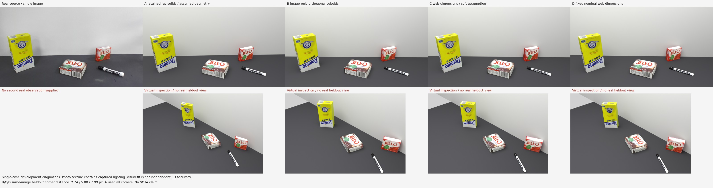
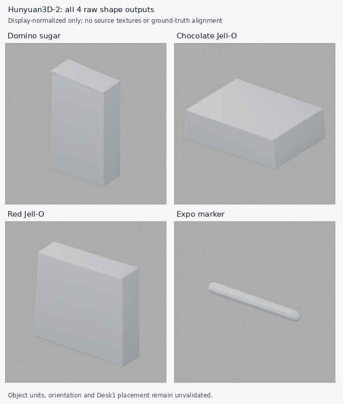

# Desk1：联网先验链路与真实方法对照

联网尺寸和细节已经接入原生 `quality_v2` 链路，并完成真实 Desk1 证据校验与相机阶段消费验证。本轮保留旧模型，实际生成、渲染三种正交盒体方案，另实际运行 Hunyuan3D-2 四对象形状基线。**目前没有达到或证明 SOTA。**

本轮结果支持一个明确的判断：联网名义尺寸能约束模型的规格一致性，但不能直接当作图中实物的精确尺寸。强制固定规格使这张图的对齐变差。独立三维精度、真实新视角和完整第三方场景重跑仍缺证据。

## 已接入的链路

`agent_identify → validate_web_research → agent_calibrate / agent_calibrate_room / agent_model / agent_materials`

- 识别阶段执行允许的联网查询，提交原样查询账本、来源、SKU/家族匹配、尺寸轴、单位、构造细节、未知项和小型文本快照。
- 可执行门检查快照路径、UTF-8、SHA256及上游交付记录，转换到米，保留冲突。运输包装尺寸和未知身份不进入建模先验。尺寸冲突不会被文本细节的同名字段绕过。
- 下游必须绑定已验证报告的哈希，记录应用到哪个参数，或说明未使用原因。此门验证证据完整性和声明范围，不自动验证网页事实、SKU判断或实物尺寸。
- 无配置的旧流程和关闭开关的流程保持原 DAG。与 RoomKit、Pi3X 和局部反馈的 DAG 可以组合；校验器自身不调用搜索服务、模型或付费 API。

使用方式与契约见 [WEB_RESEARCH_CHAIN.md](../WEB_RESEARCH_CHAIN.md)。23 条实际搜索查询及失败操作均保留。两篇原始作者表和一条 EXPO 官方产品特征构成本次执行包；其他制造商候选保持家族/规格未确认，未冒充完整归档证据。

三盒的公开参考尺寸被归一化为局部宽/深/高：糖盒 89/38/175 mm、布丁 110/35/89 mm、红盒 85/28/73 mm；布丁平放时交换局部深/高。它们是历史 YCB 参考物体先验，图中具体 SKU 和公差未独立确认。[原始作者表](https://www.ri.cmu.edu/pub_files/2015/7/ICAR-FINAL.pdf)

笔的两组作者表给出 18×121 与 19×119 mm，冲突未解决，未用于模型尺寸。当前 EXPO chisel 产品的特征仅保留为家族假设；原图笔尖有帽遮挡，不能称为已观察到的 chisel tip。[EXPO 官方特征](https://www.expomarkers.com/markers/dry-erase-markers/expo-low-odor-dry-erase-markers-chisel-tip-/SAP_1920940A.html)

## 相同源图下的实际场景结果

唯一原图为 1920×1080，SHA256 `f125bdbe59e6e978d22e5143131291a1ef5206239928007a01d26aabb1bb9578`。旧模型 SHA256 `b170ee70448a941e32a7777da1a9bc5af13bb4e727c32326c13a6af175a748ca` 前后不变。新拟合前冻结 [比较协议](DESK1_WEB_PHASE_20260930.json)，未使用 GT 模型、姿态、深度或第三方展示图作为建模输入。

| 实际方案 | 同图留出角点平均距离 ↓ | 前景 RGB MAE（0–255）↓ | 盒体最大直角偏差 ↓ | 对公开尺寸的平均绝对相对偏差 |
|---|---:|---:|---:|---:|
| A 保留的射线角点实体 | 不适用：已使用全部角点 | 12.474 | 21.308° | 未评分 |
| B 图像拟合＋既有高度假设 | 2.741 px | 14.590 | <0.0001° | 7.080% |
| C 同一拟合＋联网软尺寸先验 | 5.800 px | 14.527 | <0.0001° | 2.536% |
| D 同一拟合＋固定联网名义尺寸 | 7.992 px | 14.892 | <0.0001° | 0%，由固定输入保证 |

B 未使用本轮联网尺寸来拟合；仍沿用旧模型的糖盒高度 0.175 m 作为尺度假设，不能称为无先验的单图公制恢复。C 的 10% log 尺寸正则是预声明的实验权重，来源并未给出 10% 公差。三个新方案都使用相同的四个初始化、同一优化器与训练代价选择规则；不按留出点选择初始化。B 在缺少联网报告或可用尺寸时也可以运行。

每盒用四个顶点和两处底角拟合，共18个训练角点；另三处底角留出。这些点来自同一张图，手工估计精度约3–8 px，样本相互相关。A 的旧构建已经使用这些点，因此不赋予 A 虚假的留出成绩。

所有四语义对象、六前景网格部件均保留。新实体为正交盒体，原始网格均闭合；这反映几何参数化性质，不是实物形状、碰撞或物理资格证明。实际 `.blend` 均已只读打开，投影与优化器结果最大差异小于0.01 px。表格从实际 Blender 网格和真实渲染重新计算，见 [实际模型复核结果](evidence/desk1_web_phase_20260930/comparison_diagnostics_blend_verified.json)。旧的 builder-inventory 诊断也保留。

可见面沿用对象局部的源照片投影纹理，含原始光照；隐藏面为先验。MAE可以奖励源图投影，不能当作独立材质或三维精度。虚拟检查视图没有真实参考图，不能当作新视角验证。

## 真实学习形状基线

Hunyuan3D-2 使用同一源图的四个冻结 RGBA 掩膜，每对象实际调用一次，4/4生成闭合网格；独立重载确认4/4。官方代码、HF revision及权重 SHA 已固定，seed=2026，预声明30步/octree256，未重试、挑选种子、修网格或生成纹理。

这是**独立对象资产基线**。输出模型单位、姿态和场景摆放未经验证；不能与上表的完整场景 MAE直接排名，也不能称为完整 SimFoundry 重跑。原始网格留在远端，展示副本只作等比居中，未保存回模型。

完整配置、顶点/面数、连通性、环境和失败恢复见 [真实 Hunyuan 基线报告](DESK1_HUNYUAN2_20260930.md)；父代理另做了 [独立 PLY 读取审计](evidence/desk1_web_phase_20260930/independent_mesh_audit.json)。

SAM3D 和 SimFoundry 留在方法可用性表中。SAM3D 的官方32 GB要求及受限权重尚未满足本次运行条件；SimFoundry完整多环境/Gemini链路未执行。公开论文展示图保持“发表展示”身份。发现官方代码不代表复现成功；SAM3D论文使用GT拟合全局尺度的指标也不能称为无GT公制恢复。[冻结的官方方法清单及原始来源](DESK1_COMPARATORS_20260930.json)

## 验证、费用与保留的失败

35项测试通过：23项证据门、11项原生 DAG/接受/缓存测试、1项源图独立性回归。真实 Desk1 在复核后的代码中重新完成 ingest/preprocess/observation/identify/web gate，并验证相机阶段对真实 C 拟合的消费。重校验比较所有源元数据、快照哈希和归一化先验完全一致，复用了原始 C 拟合，未重新拟合或更改结果。原代码、旧报告、旧相机接受记录和新的重校验记录分别保留。

原生 smoke 只完成到相机阶段，**未完成该 case 的房间、模型、材质、完整审查、导出与资格验收**。表中场景由独立的 benchmark authoring 工具实际构建、保存和渲染；不得把这两类证据拼成“全原生端到端交付通过”。

- 三个新场景、六个实际CPU渲染；原生比较工作进程累计216.731 s，包含三次渲染入口失败及修复。失败原因是 Blender 的脚本目录不在 `sys.path`，发生在建模和渲染之前；未改拟合或图像参数。修复后的三次运行产生全部六个渲染，原日志未删除。
- Hunyuan准备累计1276.661 s，GPU父进程保守计费78.145 s，峰值保留显存约6.03 GB；下载保守上界5.91 GiB，模型正文全部远端直传。PyPI慢速、重复轮子下载、HF配置连接重置和恢复过程均保留，预算没有重置。
- 付费API为0。旧相机8/8、累计外观10次、既有保守GPU0.01059626 h均保留；本轮另记新资源。旧自动任务保持删除状态。本轮自有进程已退出，GPU4已释放。
- 补丁复核时出现一次小型代码 SCP连接重置和随后的旧CLI参数失败；成功重传后完成验证。这些是验证准备错误，未产生新模型或新推理。

完整源图、Blender场景、Hunyuan原始网格与原始日志位于 `4090-1:/data/real2sim_capability_wqz_20260929/desk1_web_phase_20260930/`。本地仅保存代码、协议、小摘要和预览。

## 当前方法判断

对于本例规则纸盒，图像约束驱动的正交参数模型更便于编辑且保留了较低的同图留出误差；联网规格适合作为带SKU/公差不确定性的软约束，不能强制覆盖图像证据。Hunyuan形状基线已真实可运行，提供了不规则资产分支的候选，但本轮盒体/笔的灰模与拓扑不能证明其相对三维精度。

下一项有判别力的工作是补齐 Desk1 的独立尺寸、相机、姿态/准GT或真实第二视角，再把原始学习形状放入同一明确校准/摆放协议，运行完整第三方基线。当前缺口无法由继续优化这张照片的MAE解决。当前可复用的是链路和受控候选方法，SOTA仍未成立。
