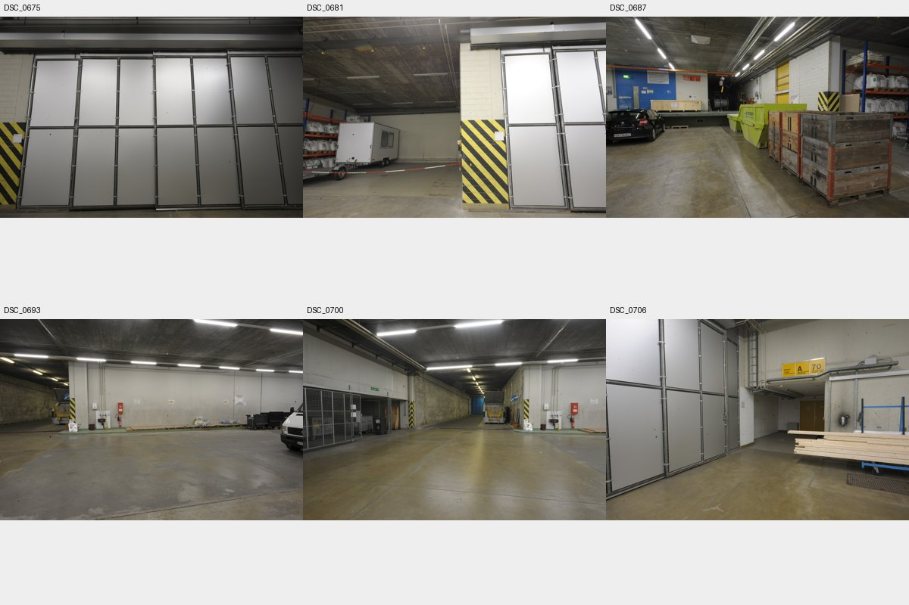
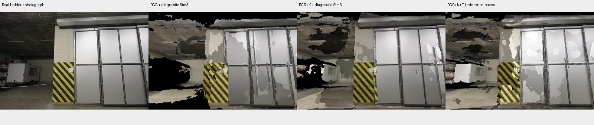

# 真实场景相机条件对照：ETH3D delivery area

2026-10-03。显式逐帧内外参已接入原生工作流；真实场景首轮参考／网格适配对照已完成。
加入参考内外参后，8 个留出视角的深度 AbsRel 从 28.13% 降至 4.96%，预测覆盖率从
76.73% 增至 86.86%。**收益主要包含尺度与位姿约束，不是所有表面几何指标都改善。**

本轮是共享 Pi3X 参考与静态可编辑网格适配器的单因素输入对照，**不是完整 Agent 语义建模、
RoomKit 部件重建、物理验收或 AWSM 作者工作流的复跑**。原生流程在真实36图上的 ingest、
preprocess、Agent 相机输入包与锁定契约已实跑；完整 quality_v2 建模／审核／交付仍未执行。

## 数据与隔离

采用 [ETH3D 官方 delivery area](https://www.eth3d.net/datasets) 高分辨率训练场景：
真实地下收货区的44张 DSLR 照片、相机标定、独立激光扫描与扫描投影深度。
它包含长通道、门、立柱、货架、车辆和货物，不使用合成住宅或重渲染图作为重建输入。
[官方标定、坐标与真值定义](https://eth3d.ethz.ch/documentation)。

- 文件名排序后固定第4、9、14、19、24、29、34、39张（零起始）作为留出集：36张建模，8张留出。
- 三组共享相同36张照片、Pi3X源代码／权重、随机种子0、420×280推理分辨率与网格构建规则，每组仅1次 forward。
- RGB不接收K或位姿；RGB+K只接收内参；RGB+K+T接收内参及注册后的参考位姿。
  最后一组属于参考位姿诊断条件，不能把输入位姿记为估计零误差成绩。
- 注册参考位姿包含数据集的扫描配准信息；“不使用 GT 几何”指不读取扫描表面／深度，而非纯在线定位条件。
- 重建位于4090-1；激光真值、完整深度和留出图位于4090-14。三组输出哈希冻结后才开始评分。
  光学评分随后单独将固定图对送到评价进程，没有再次运行重建。
- 所有大文件、权重和模型均保留远端，远端之间直接传输。本地仅保存报告、JSON与小预览。

[实验协议](evidence/eth3d_camera_20261003/protocol.json) ·
[推理协议](evidence/eth3d_camera_20261003/inference_protocol.json) ·
[官方压缩包的字节数与SHA256](evidence/eth3d_camera_20261003/acquisition_manifest.json)。

## 原始尺度结果

RGB与RGB+K仅作一次全局SE(3)坐标对齐，不拟合尺度；RGB+K+T使用允许输入的相机基线确定尺度，
再用给定K和T回投影预测深度。各组共享网格适配规则，但相机已知时采用显式相机，未知时采用预测相机。
因此该对照包含“网络条件＋显式相机使用”的系统作用，不能解释为单纯某个神经网络模块的消融。

| 输入 | 留出深度AbsRel ↓ | 留出RMSE ↓ | 留出预测覆盖率 ↑ | 含缺失惩罚MAE ↓ | 双向表面均差 ↓ |
|---|---:|---:|---:|---:|---:|
| RGB | 28.13% | 2.046 m | 76.73% | 8.292 m | 1.151 m |
| RGB＋K | 27.14% | 2.028 m | 82.30% | 6.660 m | 1.059 m |
| RGB＋K＋T（参考位姿） | **4.96%** | **0.614 m** | **86.86%** | **4.204 m** | **0.781 m** |

所有深度指标先逐视角计算，再等权平均。有效域内预测缺失按30m计入惩罚MAE，未从分母移除。
仅在有效预测上计算的AbsRel必须与覆盖率和惩罚一起看。

## 尺度对齐诊断

RGB与RGB+K额外使用仅由36个建模参考相机中心拟合的Sim(3)，**这是评价时的真值辅助**，
不代表原生恢复了米制尺度。相应尺度因子约1.28和1.27。

| 条件 | 留出AbsRel ↓ | 双向表面均差 ↓ | F-score@5cm ↑ | F-score@10cm ↑ |
|---|---:|---:|---:|---:|
| RGB＋诊断Sim(3) | 5.72% | 0.785 m | **29.27%** | **42.66%** |
| RGB＋K＋诊断Sim(3) | 5.08% | **0.706 m** | 14.21% | 41.62% |
| RGB＋K＋T（参考位姿） | **4.96%** | 0.781 m | 18.13% | 32.58% |

加入全部相机约束并未全面改善局部表面精度。RGB+K+T 的模型→激光平均距离为0.218m，
激光→模型为1.343m；遗漏区域仍然明显。当前场景保留约106万个顶点、158万个三角面，
是可编辑的逐观察表面片，并未形成可靠的语义实例、闭合实体或碰撞代理。

## 外观诊断

固定5张输入视角测量外观，另固定3张留出视角作补充。下面的PSNR／SSIM／LPIPS是3张留出视角均值；
几何与深度仍覆盖全部8张留出图。LPIPS使用实际ImageNet预训练AlexNet及v0.1学习校准权重，
没有随机初始化替代；权重哈希见[40对光学评分](evidence/eth3d_camera_20261003/lpips_results.json)。

| 条件 | PSNR ↑ | SSIM ↑ | LPIPS Alex v0.1 ↓ |
|---|---:|---:|---:|
| RGB／SE(3) | 13.37 dB | 0.3303 | 0.6200 |
| RGB＋K／SE(3) | 13.57 dB | 0.3578 | 0.5940 |
| RGB＋K＋T | **14.92 dB** | **0.4441** | **0.4961** |
| RGB／诊断Sim(3) | 13.30 dB | 0.3326 | 0.5790 |
| RGB＋K／诊断Sim(3) | 13.76 dB | 0.3719 | 0.5428 |

材质是输入照片颜色的无光照重投影，并非恢复真实PBR材料与光照。下图固定使用首张留出图，
没有按分数挑最好视角；RGB和RGB+K列展示明确标注的诊断Sim(3)。孔洞和错层均保留。

## 与AWSM的测评关系

深度评分直接加载AWSM固定提交 `4dc2f5c515b77fd5f5f8dbedbdad76663882267e` 的
`astra_blender2/tools/depth_math.py`，沿用光学Z、[0.1,30]m有效范围、AbsRel、RMSE、δ1、覆盖率和30m缺失惩罚。
源代码SHA256记录在[完整结果](evidence/eth3d_camera_20261003/comparison_final.json)。

ETH3D公开深度对应原始畸变照片，不能直接与去畸变照片逐像素比较。本次使用官方
THIN_PRISM_FISHEYE模型将160×120去畸变采样射线映射回原始深度，核对原始／去畸变相机位姿一致。
44个视角的844,800个网格位置中，90,875个（约10.76%）有[0.1,30]m内的有效激光Z值：
输入74,079个、留出16,796个。无激光值的像素是未知，绝不记为零误差。

表面评价使用官方eval扫描点云的24,898,515个点；模型端按三角形面积采样100,000点，
计算到完整激光点云的最近距离；真值端均匀采样100,000个激光点，计算到候选三角面BVH的距离。
激光点采样不是严格的均匀表面积采样。该域也包含44张官方照片覆盖而36张输入未充分覆盖的区域，
其遗漏照常计入。本次不是ETH3D官方排行榜程序的完整复跑，也不能直接与AWSM大厅的数字排名。

## 工程验证与保留的失败

- 相机内外参支持逐帧K和camera-to-world、fx≠fy、偏心主点、明确的像素中心约定、缩放后K、
  帧／文件哈希绑定、GT位姿显式诊断开关、相机锁定及缓存失效。
- 原生36张真实图运行通过：[相机接入回执](evidence/eth3d_camera_20261003/camera_integration_receipt.json)。
- 相机专项7项检查通过；Blender三组实际投影最大误差0.000193px；MuJoCo视锥回读通过。
- 既有开发回归14/14通过：[回归结果](evidence/eth3d_camera_20261003/regression_summary.json)。
  首次部署漏带两项历史夹具导致失败，补齐后复验通过，原日志保留。
- 最初的USD仓库／住宅导入预览不可用；Blender Classroom下载被Cloudflare拦截；
  合成住宅采集后来因相机数值旋转校验失败，且用户明确取消合成场景路线。它们均未计入真实场景结果。
- 首轮两个评价渲染误把sRGB颜色当作线性颜色；只修正评价颜色转换，原模型哈希不变。
  原评价产物保留，新目录后缀`_colorfix`。几何与深度结果未因该修正改变。
- LPIPS首次导入缺少SciPy，随后复用已有运行时依赖；研究推理环境未安装或更新模型依赖。

## 产物与复跑

相机接口说明：[CAMERA_OBSERVATIONS.md](../CAMERA_OBSERVATIONS.md)。
三次真实forward均完成，峰值CUDA reserved约17.3–17.8GB；首组存在冷启动影响，不能将各次耗时作为吞吐排名。
[推理回执](evidence/eth3d_camera_20261003/inference_summary.json) ·
[校准网格回执](evidence/eth3d_camera_20261003/calibrated_mesh_receipt.json)。

远端工作目录：

- 原始数据、真值、评价与Blender场景：`4090-14:/data/wqz/real2sim-awsm-20261003/eth3d/benchmark_v1/`。
- 已知内外参候选：`evaluation/RGB_K_T_colorfix/editable_scene.blend`。
- 原始Pi3X输出、全部失败日志、权重与原生接入运行：`4090-1:/home/wqz/real2sim_awsm_20261003/`。

脚本顺序为 `prepare_eth3d_camera_benchmark.py` → `run_large_scene_camera_ablation.py` →
`prepare_eth3d_evaluation.py` → `evaluate_eth3d_mesh_blender.py` → `summarize_eth3d_evaluation.py`。
每次须使用新输出目录；评价器必须在全部模型冻结后执行。LPIPS实际执行脚本随证据保存。
Pi3X权重按其CC BY-NC 4.0研究许可使用，未随仓库分发；ETH3D原始数据也未随仓库分发。

下一阶段应固定新的、作者未见的留出集，再让Agent用相机与参考几何构建语义部件和完整房间，
运行quality_v2结构／视觉／碰撞验收。不能把当前静态参考适配的分数宣传为完整工作流成绩。
