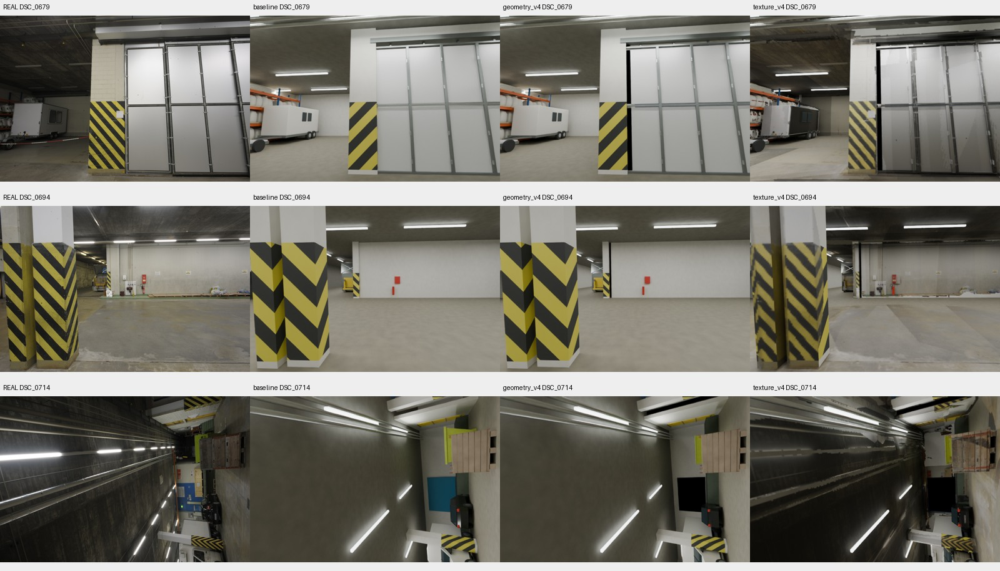

# ETH3D 几何与纹理修复

本实验接续[独立建模对照](ETH3D_WORKFLOW_COMPARISON_20261003.md)，针对 OURS v3 过大的矩形房间外壳、源图端点偏差和缺乏真实表面纹理进行修复。原始 OURS／AWSM 模型、分数和失败记录均保留。

最终选定几何 v4 与对应纹理版。相对原 OURS v3，**双向表面均距从 1.963 m 降至 0.482 m（下降 75.43%），图像 LPIPS 从 0.556 降至 0.411（下降 26.06%）**。这些是已暴露测试集的诊断改善。候选仍是 **LIMITED**：真正原生几何审核记录为 `changes_requested`，软表面坐标审计仍失败，不能宣称完整视觉、原生交付或物理验收通过。

## 修复前后预览与分数

从左到右：真实照片、原 OURS v3、仅修几何、同一几何加照片纹理。固定取原测试集的第 1、4、8 个视角，没有按修复效果换图；[全部 8 个视角](evidence/eth3d_repair_20261003/all_exposed_test.jpg)同时保留。图片直接来自冻结场景渲染，未作生成式图像增强。

| 相同评价口径 | 原 OURS v3 | 几何 v4 | 几何 v4＋纹理 |
|---|---:|---:|---:|
| 全模型表面 → 已观测激光均距 ↓ | 3.814 m | 0.859 m | 0.859 m |
| 已观测激光 → 全模型表面均距 ↓ | 0.112 m | 0.106 m | 0.106 m |
| 双向均距 ↓ | 1.963 m | 0.482 m | 0.482 m |
| F-score @ 5 cm ↑ | 9.879% | 15.984% | 15.984% |
| 原测试 8 视角深度 AbsRel ↓ | 6.438% | 5.158% | 5.158% |
| 原测试深度 RMSE ↓ | 1.118 m | 0.902 m | 0.902 m |
| 原测试深度有效覆盖率 ↑ | 100.000% | 99.979% | 99.979% |
| 原测试深度 MAE，缺失按 30 m 惩罚 ↓ | 0.429 m | 0.361 m | 0.361 m |
| 原测试 PSNR ↑ | 13.743 dB | 13.691 dB | 14.454 dB |
| 原测试 SSIM ↑ | 0.525 | 0.522 | 0.553 |
| 原测试 LPIPS Alex v0.1 ↓ | 0.556 | 0.552 | 0.411 |

深度和图像指标为逐视角等权平均。修复后 GT 深度缺失为输入 48／原测试 3 像素，基线为 6／0；GT 分母保持 74,079／16,796。几何改善集中在模型到激光的距离，反向距离改善较小；不能据此声称所有局部几何都更准。仅几何版的 PSNR／SSIM略降，纹理版才明显改善外观。纹理版与几何版使用相同几何，不以外观改善冒充几何改善。

原 AWSM 候选没有参与这轮修订，也没有获得同等追加工作；本表不是新的公平方法排名。[原始对照](ETH3D_WORKFLOW_COMPARISON_20261003.md)中的 AWSM 双向均距 0.445 m、F-score@5cm 25.630%仍优于修复后的相应几何指标。

[完整指标与 LPIPS 聚合](evidence/eth3d_repair_20261003/repair_v4_final.json) · [原始分数](evidence/eth3d_repair_20261003/repair_v4_metrics.json) · [39 对实际 LPIPS](evidence/eth3d_repair_20261003/lpips_results.json) · [几何冻结](evidence/eth3d_repair_20261003/geometry_v4_freeze.json) · [纹理冻结](evidence/eth3d_repair_20261003/texture_v4_freeze.json)。

[独立冻结后数值复核](evidence/eth3d_repair_20261003/audit/postfreeze/postfreeze_independent_summary.md)重新构建全激光点 KD-tree 并查询样本，几何均值／F-score 与报告差为 0；几何版与纹理版的深度、反向距离和表面样本三数组逐字节相同。39 对 LPIPS 的图像、实际权重哈希和聚合通过复核，基线 13 个逐图值与原结果完全相同；没有再次执行 LPIPS 网络前向来冒充独立复算。

## 修复方法与证据边界

几何作者只使用原有 36 张输入 RGB、锁定的相机内外参、DA3 预测和原始标注。房间由一个覆盖约 2008.5 m² 的矩形，改为主厅、储物区、走廊、笼车区域和入口五个区域的并集，面积约 940.13 m²。这是实际网格与静态碰撞网格的更改，不是对评价点作裁剪或隐藏几何。远端走廊边界与遮挡区域仍保留来源和不确定性。

纹理绑定在物体表面 UV 上，由输入照片投影生成。投影需同时满足实际网格首交点、对象身份、深度支持和表面法线条件；没有照片支持的区域保留原 PBR 材质。照片中的照明会进入颜色纹理，因此它是采集时的表面外观，不是测量得到的本征反射率。

最终纹理只改变 Base Color：原颜色程序链作为无支持区域的回退，Normal／Bump、粗糙度、金属度、Alpha、Emission、灯光与曝光保持。303 个对象、738 个面使用照片层，2 个图集全部 packed；5,371,573 个表面纹理像素中 1,741,643 个得到支持（32.42%），其余 3,629,930 个保留回退。这个比例是图集表面像素支持率，不是场景面积覆盖率。独立评审核对了真实节点、原始图像哈希、图集 alpha 全量计数和 96 个确定性纹理点的实际首交点。

几何与纹理分别冻结，保留材质／灯光／可见性控制。原 8 张留出照片的结果已经向协调者和用户揭示，本次复用只能称为 **exposed-test diagnostic（已暴露测试集诊断）**，不能当作新的独立泛化测试。新 GT 分数不反馈给建模作者作选择。

选择几何 v4 前，通看固定 10 个输入视角，并检查全部 36 个输入的 DA3 深度参考。相同 689,349 个参考像素上，条件 AbsRel 均值 7.773%→6.661%，30 视角改善、6 回归；缺失数 415→1120，计入 30 m 缺失惩罚后均值 0.53355→0.50562 m，22 改善、14 回归。输入 12 的 AbsRel 6.381%→7.630%，车辆体量与后方蓝色区域仍欠拟合。以上是**输入预测深度参考**，与前表激光 GT 评价分开记录。[完整输入回归](evidence/eth3d_repair_20261003/input_depth_regression_v4.json)。

## 验证与失败保留

首个几何候选的 shell 检查通过，但实际部件变换存在偏差，已[拒绝晋升](evidence/eth3d_repair_20261003/audit/GEOMETRY_V1_REJECTED.md)。其[冻结记录](evidence/eth3d_repair_20261003/geometry_v1_freeze.json)与[完整诊断分数](evidence/eth3d_repair_20261003/geometry_v1_rejected_diagnostic.json)保持原样；首轮纹理亦仅作为诊断保留。

第二版的 148 个实际求值部件通过变换核对，最大差约 2.071 µm；38 个绑定通过，六个壳体的闭流形、正体积、重复面、30 个地面单元和 133 条车库开口射线检查通过。但料斗 median 10.279 px 仍超过 9 px，货车一处旧接触锚点距实际网格 0.579 m，故[第二版仍拒绝结构接受](evidence/eth3d_repair_20261003/audit/GEOMETRY_V2_REJECTED.md)。重载后 19 个顶点哈希差异另行保留；实际变换误差为微米量级，不静默替换原哈希记录。

第三版通过直接结构数值检查，但协调者通看[固定源视角对照](evidence/eth3d_repair_20261003/comparison_1.jpg)后发现木材车／笼区被遮挡，故仍[拒绝视觉接受](evidence/eth3d_repair_20261003/v3_source_visual_rejection.json)。它最初看起来像新增实墙；作者与独立评审分别追踪首交点后，均定位到被错误撑大的 `ceiling_pipe2`。对旋转圆柱直接修改 `dimensions.x` 放大了径向尺寸，不能当成世界 X 方向的管长裁剪。数值端点／壳体检查通过不能代替完整源视角复查。照片投影的深度门控拒绝给这个错误遮挡物贴背景纹理，因此没有用贴图掩盖几何错误。

工作流增加非矩形房间的显式拒绝检查：声明 `bounds_only`、非矩形拓扑或 `mesh_only` 后，禁止把包围矩形自动转换成 MuJoCo 碰撞壳。24 个 helper 负例和 8 个实际导出入口负例通过，后者确认没有生成 XML 或成功审计文件。[独立检查记录](evidence/eth3d_repair_20261003/audit/PROTOCOL_REVIEW.md)。该修改不实现非矩形房间的原生动力学支持，也不代表物理验收通过。

## 原生审核与尚未解决的部分

最终 v4 的真正 `Workflow.run` 完成 `build_geometry`，结构审计为 `passed`、0 项失败，并实际产出 36 源视图、6 源裁图、45 部件／组合视图、1 灰模、2 整体与 4 墙面图。随后真正 `Workflow.accept` 将 `agent_review_geometry` 记录为 **`changes_requested`**，保留输入 12 的近似和源可见性未决项；没有把数值通过写成完整视觉接受。

[实际原生状态与运行时代码哈希](../../examples/eth3d_repair_20261003/geometry/evidence/NATIVE_FINAL_REPAIR_SUMMARY.json)、[完整修订账本](../../examples/eth3d_repair_20261003/geometry/evidence/ITERATION_LEDGER.json)与[重载后几何收据](../../examples/eth3d_repair_20261003/geometry/evidence/after_reload_evaluated_mesh_receipt.json)均保留。几何执行使用记录的冻结作者运行时及碰撞保护修改；新增材质坐标适配用当前源码单独回归和检查冻结纹理图，没有把后写代码回填成既有执行快照。

独立源射线诊断由基线 6 处外部遮挡变为 v4 的 5 处：4 处保留相同柱／平台遮挡；笼区一点由原笼栏遮挡变为上方墙体遮挡，其可见性仍未解决。未发现相机落在候选内部。料斗上沿两个点有相邻输入视角三角化支持，底部支撑仍只有单视图预测深度与地面接触假设。[独立模型／纹理审核与边界](evidence/eth3d_repair_20261003/audit/FINAL_AUTHOR_SCOPE_REVIEW.md)。

原生材质合同新增 `per_node`，精确声明每个材质的每个活跃纹理节点坐标，支持刚性表面的 UV 照片与 world 程序回退并存。漏项、多余节点、坐标错配仍拒绝；修复了隐式 UV 错用编辑器当前层、与真实 render-active 层不一致的漏检。旧 3 组合同／Blender／worker 回归、9 个 schema 例和 16 个真实 Blender 例通过，另有独立 schema 与实际渲染复核。[使用契约](../WHOLE_SCENE_APPEARANCE.md) · [独立代码检查](evidence/eth3d_repair_20261003/audit/PER_NODE_CONTRACT_REVIEW.md)。

冻结纹理版仍产生 **75 条 soft-world 失败，涉及 45 个对象**：继承的程序回退／凹凸使用世界坐标，而软表面规则要求每个纹理节点使用 UV。没有重分类软物体或豁免检查。照片层绑定通过不能抵消该失败，因此正式材料／灯光／最终审核与导出验收未获完成。

外观仍有接缝、A70 标识重影、部分墙面／车辆／柜体的几何与贴图偏差。固定输入的地面亮度修正建议方向不一致，因此未新增统一曝光或灯光调整来掩盖局部误差。原生非矩形碰撞导出仍显式拒绝；本轮没有建立 GLB／USD 等价交付或机器人动力学成功。

最初 30 分钟修复计划已超时；后续投入用于保留和修复独立发现的变换、连接和巨管遮挡问题，以及真正原生执行与独立验证。原生两轮使用 8 CPU 线程，共同诊断评价仍为 2 线程。不能宣称修复与原 AWSM 作者使用相同预算。

## 测量口径

评价保留原始相机、刚性坐标变换、全部 44 个深度视角、90,875 个 GT 有效像素和全量 24,898,515 个激光参考点。全模型按面积采样 100,000 点；反向也保留 100,000 个激光样本。外观固定为 5 个输入与全部 8 个原留出视角，不选择好看的照片替换失败视角。

全模型指标包括推测的外壳、背面与内部结构，激光仅覆盖已观测表面，点密度也不是面积均匀分布。它不是官方 ETH3D 排行指标，不证明不可见区域的实物精度。仅撤销预声明刚性坐标变换，没有利用 GT 对修复模型重新拟合位姿或尺度。使用的是明确允许的参考相机位姿，不是位姿估计成绩。

旧模型通过新的聚合工具重算，全部既有几何／深度／图像指标一致，见[baseline 重算](evidence/eth3d_repair_20261003/baseline_recomputed.json)。新 LPIPS 图像对生成器的 13 个基线源图哈希与原输入逐一相同。深度分数使用逐视角等权平均；缺失深度按原规则保留惩罚。

本地仅保存代码、参数、小型证据与预览。模型、纹理图集、原始照片、预测和激光数据保留在远端。

配方、已拒绝尝试、运行方式与小型证据见 [修复示例](../../examples/eth3d_repair_20261003/README.md)。最终权威模型为 `4090-1:/home/wqz/real2sim_agent_repair_20261003/geometry/candidate_v4/model.blend`（SHA `506982c1…5542`）及 `texture/final_texture_v4/model.blend`（同一远端根目录，SHA `f36a6b79…bb2f`）；完整 SHA 位于冻结记录。原始冻结模型的重载／测量已验证，另一路径上的完整建模配方重放仍未作为本次验收证据。前两版修复源码为事后恢复记录，最终 v4 源码单独保留，不能把恢复配方当作旧版本运行前的不可变源文件。
