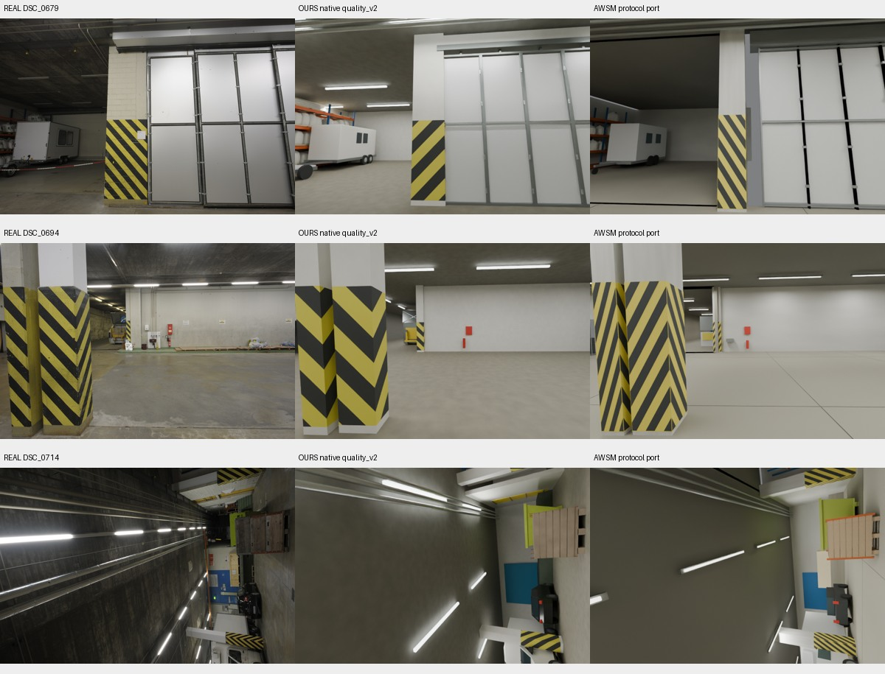

# ETH3D 实拍场景：原生工作流与 AWSM 协议对照

2026-10-03。独立建模、冻结后测量和独立数值复核均已完成。**这是两个语义场景候选的测评完成，不是原生交付验收通过。** OURS 的实际结构审查仍有 5 项失败；两组均未通过整场景视觉或物理验收。

相机内外参已接入正式工作流，包含逐帧绑定、缩放、坐标变换、渲染、结构投影和缓存失效。详见[相机接口](../CAMERA_OBSERVATIONS.md)。本次使用真实 [ETH3D delivery_area](https://www.eth3d.net/datasets) 的 44 张照片和官方激光真值；它替代此前仅测试 Pi3X 网格适配的[相机试验](ETH3D_CAMERA_20261003.md)，两次结果不能混成同一实验。

## 实际重建预览

从左到右为真实留出照片、OURS 原生流程候选、AWSM 协议移植候选。渲染直接来自冻结 Blender 场景，未作生成式图像增强。第三行保留了真实相机的旋转方向。

紧凑预览固定取第 1、4、8 个留出视角；[全部 8 个留出视角](evidence/eth3d_full_agent_20261003/all_heldout.jpg)保留，包括遮挡和表现较差的区域。

## 两条流程的区别与共同条件

| 项目 | OURS | AWSM 协议移植 |
|---|---|---|
| 建模组织 | 实际 `quality_v2` 阶段运行、语义部件、装配声明、源图地标及结构门槛 | 依照公开建模／检查／修订协议，从空场景独立构建语义部件 |
| 几何来源 | 独立编写场景配方，没有把预测点图三角化当作成品 | 独立编写场景配方，没有复用 OURS 的几何或布局 |
| 最终候选 | v3，107 个语义实体、801 个可见构件 | v2，49 个语义实体、815 个可见构件 |
| 实际预算使用 | 3 个版本、30 次固定配对检查、1 次额外复用的原生诊断图 | 2 个版本、20 次固定配对检查 |
| 完整输入深度检查 | 恰好 3 次 × 36 视角 | 恰好 3 次 × 36 视角 |
| 原生交付状态 | `FAILED_NATIVE / LIMITED` | `LIMITED`，未走本项目原生交付门槛 |

两名建模 Agent 使用新上下文、分离目录，同一批 36 张 RGB、逐帧 K 和参考位姿，以及同一份 **DA3-GIANT 实际推理结果**。8 张留出照片、GT 深度和激光点云未提供给建模 Agent。参考位姿是显式允许的诊断条件，不是位姿估计成绩。两个 Agent 和独立评审继承同一当前模型，工具没有给出精确服务模型标识，不能声称复现了原作者 Astra 模型。

预注册上限是 5 个版本、50 次固定配对检查、10 次有理由的补充检查、7200 秒作者预算、每个 Blender 2 个 CPU 线程；实际修订次数和原生诊断成本不同。隔离通过上下文与路径规则实现，未使用操作系统文件权限沙箱。协调者此前看过 Pi3X 试验分数和一个留出预览，这一历史暴露已在作者开始前登记；新作者未收到这些信息，也未收到本次 GT 分数反馈。

这是公开 [AWSM](https://github.com/wentingw/AWSM) 协议在真实 ETH3D 场景上的移植。它与原 World Lobby 的 180 视角、Blender 5.2 和作者运行环境不同，本次建模用 Blender 4.5.3，统一评价用 4.5.4。原 AWSM 的 vendored 深度环境不可用，故两组共用官方独立 DA3 实现；不称为原实验复现或完整方法排名。

## 冻结后的共同测评

下表深度与图像指标均为**逐视角等权平均**。GT 有效域保留全部 90,875 个像素：输入 74,079，留出 16,796，来自 844,800 个采样位置；没有用模型有效性缩小 GT 分母。

| 指标 | OURS v3 | AWSM v2 |
|---|---:|---:|
| 留出深度 AbsRel ↓ | 6.438% | **4.649%** |
| 留出深度 RMSE ↓ | 1.118 m | **1.054 m** |
| 留出深度有效覆盖率 ↑ | **100.000%** | 97.660% |
| 留出深度 MAE，缺失按 30 m 惩罚 ↓ | **0.429 m** | 1.025 m |
| 全模型表面 → 已观测激光均距 ↓ | 3.814 m | **0.813 m** |
| 已观测激光 → 全模型表面均距 ↓ | 0.112 m | **0.077 m** |
| 双向均距 ↓ | 1.963 m | **0.445 m** |
| F-score @ 5 cm ↑ | 9.879% | **25.630%** |
| 留出 PSNR ↑ | **13.743 dB** | 13.277 dB |
| 留出 SSIM ↑ | **0.525** | 0.506 |
| 留出 LPIPS Alex v0.1 ↓ | **0.556** | 0.579 |

AWSM 候选对已观测深度和激光表面的拟合更好；OURS 的射线覆盖与缺失惩罚分数更好，图像指标略好。**覆盖率不等于几何完整性，图像分数也不能抵消结构验收失败。** 两组外观都仍较粗糙，未达到照片级重建。

深度沿用 AWSM 固定提交 `4dc2f5c515b77fd5f5f8dbedbdad76663882267e` 的 `depth_math.py`，测量光学 Z、有效范围 0.1–30 m，采用 160×120 射线。按照 ETH3D 的 THIN_PRISM_FISHEYE 标定，将去畸变图像射线映射回原始稀疏深度，不把两种像素网格直接对齐。透明材料在 RGB 中保留透明效果，深度测量使用可见几何的首个不透明交点。留出缺失像素 OURS 0、AWSM 329；输入缺失分别 6、906。按像素池化的留出 AbsRel 是 5.744%／4.173%，不能与上表等视角宏平均混用。

几何采用 100,000 个按三角形面积采样的候选点查询全部 24,898,515 个激光点；反向用 100,000 个均匀抽取的激光点查询候选三角形 BVH。只撤销预声明刚性坐标变换，没有 GT 尺度或位姿拟合。该指标包含模型推测补全的外壳、背面和内部结构，而激光只覆盖实际观测面；激光点密度也不是表面面积均匀分布。因此它是**全候选对已观测真值**的距离，不能称为不可见区域真实误差或官方 ETH3D 排行分数。独立复算确认 OURS 较大的 3.814 m 不是漏撤销坐标变换或数值聚合错误。

外观固定评价 5 个输入视角和全部 8 个留出视角，每组 13 对。保留各自材料、灯光和色彩设置，统一 CPU Cycles、16 samples、640 像素宽度和原宽高比；LPIPS 使用实际预训练 AlexNet 权重，输入同图 sanity check 为 0。

## 原生失败与复现边界

OURS 的 `build_geometry` 实际执行成功，包含全部 36 源视角、45 部件／组合视图、6 源裁图、1 灰模、2 整体和 4 墙面诊断；随后 `Workflow.accept` 将几何审核记录为 `changes_requested`。四组源图端点不满足固定 median ≤ 9 px、max ≤ 18 px 门槛：前方料斗 max 41.010 px、货车 33.556 px、小车 27.566 px、远处笼车 30.598 px；另有平板拖车框架与牵引杆的预期接触未按结构契约声明。审计采样深度 0.047643 m 不是物理穿透量。诊断说明不能替代声明，也没有豁免失败。

v2 原生构建曾在 1500 秒后超时，其 11 项失败与已有图像保留。[v3 最终状态 addendum](../../examples/eth3d_workflow_comparison_20261003/OURS/NATIVE_FINAL_ADDENDUM.md)记录实际完成情况，不回写早期快照。后续正式材料／灯光、最终审查、export／validate／report 没有获准完成；现有材料和灯光属于候选设置。测评冻结不是 `Workflow.freeze`。

额外技术导出诊断：Blender 重载通过；GLB 的相机 FOV／shift 严格回读失败；USD 有 32 项部件身份失败。因此 Blender 与逐帧相机 JSON 为权威材料，不能宣称 GLB／USD 等价交付或物理可用。AWSM 有 46 个隐藏碰撞代理，但没有刚体／关节仿真验收。

OURS 的 v1 配方被覆盖后按本次记录恢复，缺少运行前源文件哈希，也未完成几何重放证明；原始 v1 模型和检查结果保留。最终 v3 源码与参数完整冻结。仓库提供两组的场景重建配方，尚未执行另一台机器上的完整配方重放；可运行配方不等于跨环境几何身份已验证。

## 证据、版本与运行方式

- [预注册协议](evidence/eth3d_full_agent_20261003/protocol.json)、[共同预测深度清单](evidence/eth3d_full_agent_20261003/depth_manifest.json)。DA3 官方源码 `3d835ec1a5802d64a8b8b15f817a1ab54809bfe4`，权重 `depth-anything/DA3-GIANT` revision `7cd62ae9315b9dff094d2d300e4ad012640607dd`。17 个四帧窗口、stride 2、process resolution 392、upper_bound 和 centrality 选择，36 帧输出 266×392。推理 26.23 秒不包含模型下载或后续建模。
- [最终全部指标](evidence/eth3d_full_agent_20261003/comparison_final.json)、[26 对 LPIPS](evidence/eth3d_full_agent_20261003/lpips_results.json)、[独立数值复核](evidence/eth3d_full_agent_20261003/audit/audit_summary.md)。外壳六个对象占 OURS 表面采样的 79.06%、模型到激光距离总和的 95.31%。不能把这全部认定为合理补全：错误边界／布局与激光覆盖缺口尚未完全区分，未做事后裁剪以改善分数。独立审计核对了 LPIPS 的输入、哈希和聚合，没有再次运行网络前向。
- [OURS 冻结](evidence/eth3d_full_agent_20261003/OURS_freeze.json)与[独立评审](evidence/eth3d_full_agent_20261003/OURS_independent_review.json)；[AWSM 冻结](evidence/eth3d_full_agent_20261003/AWSM_freeze.json)与[独立评审](evidence/eth3d_full_agent_20261003/AWSM_independent_review.json)。冻结文件保留冻结时刻状态，不以事后状态覆盖。
- [两组配方与运行记录](../../examples/eth3d_workflow_comparison_20261003/README.md)。OURS 原生源码快照基于 `735be2f` 加其记录的 5 个文件修改；后续协调者的缓存修复和旧相机兼容修复没有用于此作者运行。
- [相机验证记录](evidence/eth3d_full_agent_20261003/camera_validation)、[评价器解析夹具与 8 项验证](evidence/eth3d_full_agent_20261003/evaluator_validation)。实际 6 m 壳体、刚性变换、隐藏代理、透明外观／不透明深度、相机投影与模型不变性检查通过。38,400 条射线全部保留，120 条精确边界射线用预先列出的 2 m／6 m 合法集合验证；最大深度误差 2.384e-6 m，标记投影误差 0.0593 px。

共同检查器曾漏掉 collection 层级的隐藏代理，修复后独立比较两组 v1 的可见几何签名均与旧结果一致。其兼容性证据保留；没有因为修复而隐藏或替换已有失败。最终相机接口通过 9 项针对性测试、15 项真实 Blender 多相机／结构检查、14 组已有回归及实际空房间与 7 个负例检查。

统一评价入口为 `tools/evaluate_agent_scene_blender.py`，输入冻结模型、freeze JSON 和固定 truth 目录；`tools/summarize_agent_comparison.py` 聚合两组结果，`tools/score_lpips_pairs.py` 补充实际 LPIPS。具体参数见脚本 `--help`。原始照片、激光、预测数组、模型和权重留在远端；Git 只存小型代码、参数、证据与预览。

下一步应先修复四个源图端点和拖车接触声明，再在**新实验版本**中评价；不可继续利用本轮已揭示的留出分数调参后仍称独立留出结果。本轮不证明 SOTA、其他场景泛化或机器人任务成功。
