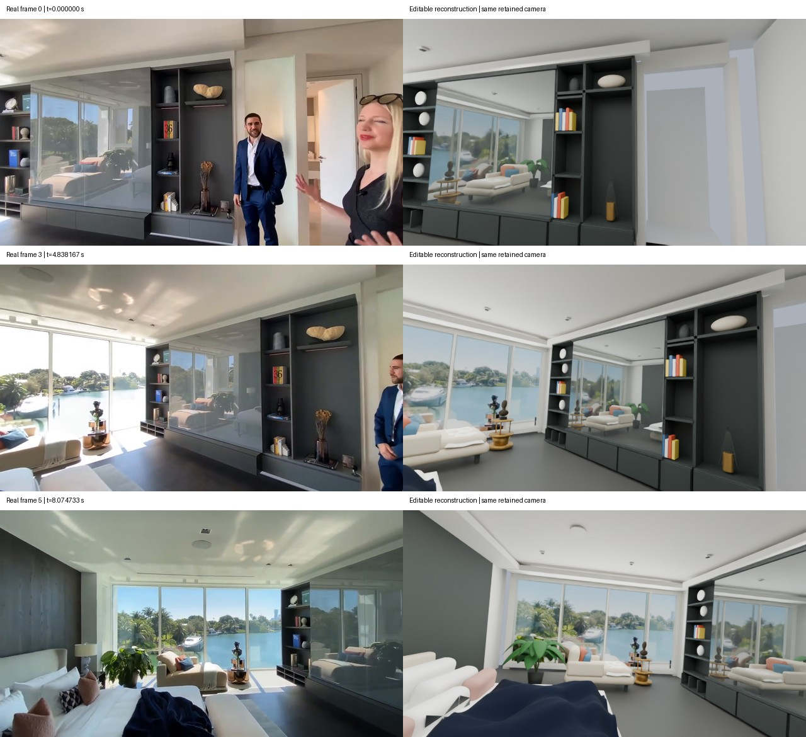

# Waterfront editable reconstruction checkpoint

Left: three actual source-video frames. Right: new editable Blender scene rendered
with retained camera estimates. Model: `4090-1:/data/real2sim_capability_wqz_20260929/waterfront_scene_002/scene.blend`.
173 mesh parts, 14 assemblies, 6 source cameras; packed background image.

[Report, provenance, assumptions and remaining differences](../../docs/research/WATERFRONT_EDITABLE_DELIVERY_20260930.md).
Source footage: [AHa-3D Waterfront demonstration](https://kevinxu02.github.io/real2sim-indoor-site/media/minimax/bedroom_waterfront_g0024/source-web.mp4).
People omitted; exterior uses a labelled captured backdrop. Unmeasured scale,
hidden surfaces and materials remain assumptions. This is not physical qualification.
